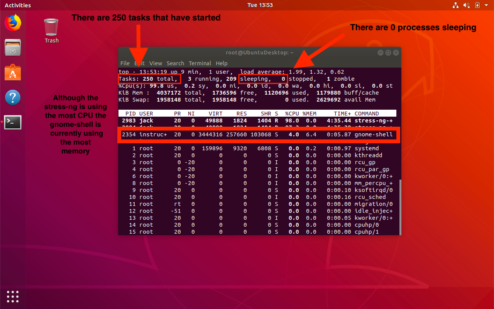
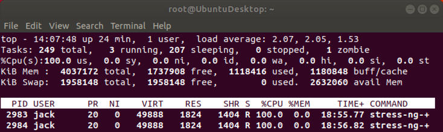
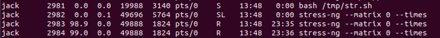

## Solution Guide: Process Investigation

The goal of this activity was to identify resource draining services affecting our system. More specifically this activity required the following steps:

- Use `top` to monitor for suspicious processes.

- Use `ps` to see what processes are running.

- Identify a suspicious process.

- Research signal flags used with the `kill` command.

- Use the appropriate `kill` signal to stop the suspicious process.

---

<<<<<<< HEAD
- In the last activity, we completed a basic audit of the system and found some malicious script files and a user that was not supposed to be on the system. Now we will investigate all the processes running on the system to see if there are any obvious processes that should not be running.

- Your senior administrator has asked that you record snapshots of processes as well as review the processes in real time for anything suspicious.

- You must look at the processes that are running on the system to make sure nothing is amiss. If it is, you will want to `kill` that process and add what you found to your report.

### Instructions

Log into the lab environment with the following credentials: 
- Username: `sysadmin` 
- Password: `cybersecurity`

To get started with your activity, run the following command in your terminal: 

- `sudo bash /home/instructor/Documents/setup_scripts/instructor/processes.sh </dev/null &>/dev/null &`

After which, you'll be able to use your terminal like normal.

Please read the following instructions and complete the steps.

=======
>>>>>>> 5e7628b1fe1ff96f54830488bfafc2a281131ba2
1. During the last activity, you found a script file in a strange location on the system. Take a look at the contents of this script file to get an idea of what commands you might be looking for.

    - List all the running processes in real time.
      - Solution: `top`

    - Review the help menu for this command and get a few ideas of what you want to investigate.
      - Solution: `man top`

    - Highlight the column that you are sorting by.
      - Solution: You can enable column highlighting and sorting by pressing the `x` key. By default, the `%CPU` column is highlighted and sorted by highest `CPU` usage.

<<<<<<< HEAD
2. To get an idea of how the system is currently running, answer these questions:
   **Note:** Answers will vary by machine. We'll use the example image below to answer these questions

   - How many tasks have been started on the host?

=======

2. To get an idea of how the system is currently running, answer these questions:

   **Note:** Answers will vary by machine. We'll use the example image below to answer these questions

   - How many tasks have been started on the host?
>>>>>>> 5e7628b1fe1ff96f54830488bfafc2a281131ba2
     - Solution: `250`
     
   - How many of these are sleeping?
     - Solution: `0`

   - Which process uses the most memory?
     - Solution: `gnome-shell`

3. Search all running processes for a specific user.

    - Look at all the processes started by the `root` or `sysadmin` user.
      - Solution type: `u` followed by the name of the user. 

    - Sort by other users on the system that may be of interest.
  
<<<<<<< HEAD
     **Hint**: In the previous exercise, you found a home directory for a user who should not be on this system. Is that user running processes?
=======
     **Hint**: In the previous exercise, you found a home folder for a user who should not be on this system. Is that user running processes?
>>>>>>> 5e7628b1fe1ff96f54830488bfafc2a281131ba2
      - Solution: Jack is running the `stress-ng` processes
      

<<<<<<< HEAD
**Bonus**     
=======
**Bonus**
>>>>>>> 5e7628b1fe1ff96f54830488bfafc2a281131ba2

4. Next, take a static "snapshot" of all currently running processes, and save it to a file in your home directory with the name `currently_running_processes`.

    - Use the flag to list all processes that have a TTY terminal.
      - Solution: `ps aux >> ~/currently_running_processes`

    - In the short list of output, do you notice any processes that look suspicious?
      - Solution: Yes, jack is running a process `stress0ng --matrix 0 --times`. These commands intentionally stress the system and consume resources which could result in a Denial of Service from the server.

5. Identify the ID of any suspicious process. Kill that process with the `kill` command.
    - Solution: Run `kill <PID number>` or `kill 4714 4715`.

<<<<<<< HEAD
6.  `Kill` all processes launched by the user who started the command you just killed. 

    - Use Google and the man pages to identify a command and flag that will let you kill all processes owned by a specific user.

 -------
=======

6. `Kill` all processes launched by the user who started the command you just killed. 

    - Use Google and the man pages to identify a command and flag that will let you kill all processes owned by a specific user.

  - Solution: `sudo killall -u jack`.

-------
>>>>>>> 5e7628b1fe1ff96f54830488bfafc2a281131ba2

© 2020 Trilogy Education Services, a 2U, Inc. brand. All Rights Reserved.

