# 7.3 Lesson Plan: Windows Active Directory Domain Services

- Credentials for the Windows RDP Host machine:
  - Username: `azadmin`
  - Password: `p4ssw0rd*`

- Credentials for the Windows 10 machine for today's activities:
  - Username: `sysadmin`
  - Password: `cybersecurity`

- Credentials for the Windows 10 machine for today's activities:
  - Username: `sysadmin`
  - Password: `p4ssw0rd*`


## Demo: Creating Domain OUs, Users, Groups (0:20)

- We need to set up Marketing associate, Caroline, as a new user in Active Directory. 

- To do this, we will need to create organizational units (OUs), users, and groups.

We will complete the following tasks:

- Create a new domain organizational unit called `GC Users`.

- Create a sub-OU called `Marketing`.

- Create a user, `Caroline`, under the `GC Users > Marketing` OU.

- Create a group, `Marketing`, under the `GC Users > Marketing` OU.

### Creating Organizational Units

At the top-right of the Server Manager, click **Tools**, and open the **Active Directory Users and Computers (ADUC)** tool.

- Explain that we use this tool to manage user and computer objects within a domain. We will be creating our users, groups, and organizational units with this tool.

- OUs are logical groupings of an organization's assets and accounts, used to manage these assets together. For example, all the computers in the Marketing department of a company should be grouped together in an organizational unit (OU). This OU might be called `GC Users > Marketing`. All of the computers in this OU have the same policy, which is set by the Group Policy.

- OUs allow us to distinguish computer objects based on how they are functionally associated with one another within the organization.

- OUs allow us to apply custom permissions, rules, and settings for users and groups in the domain through Group Policy Objects, which are collections of policy settings. We will learn more about these later. For now, we will look at creating OUs.

With ADUC still open, complete the following steps:

- Right-click **GOODCORP.NET**, go to **New**, then **Organizational Unit**.

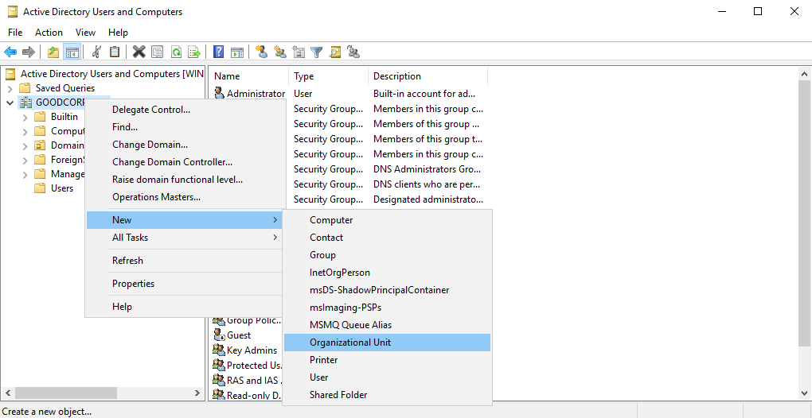

- Name this OU `GC Users` (short for Good Corp, Inc.).

We now have a top-level organizational unit to hold all of our domain's users. Now we need to add a layer of organization to distinguish users. 

Let's create the `Marketing` sub-organizational unit.

- Right-click **GC Users**, then click **New**, then **Organizational Unit**.

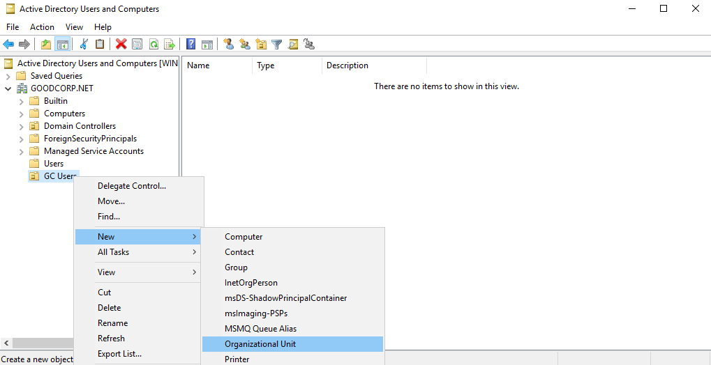

- Name this sub-OU `Marketing` and click **OK**.

We now have a sub-OU for our Marketing team. This will include our Marketing team users, who will all have the same policies applied to them. 

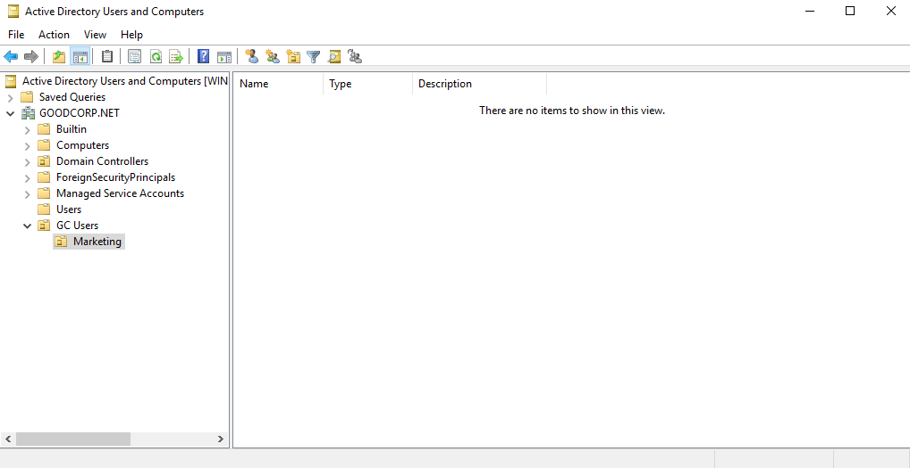

Now, lets add a user. 

### Creating Users

Explain that users are the domain accounts that people log in with. Let's look at how to create the user `Caroline` under the `Marketing` organizational unit we just created.

With ADUC still open, complete the following steps:

- Click to expand the **GC Users** organizational unit, right-click **Marketing**, then **New** > **User**. The New Object - User window will appear.

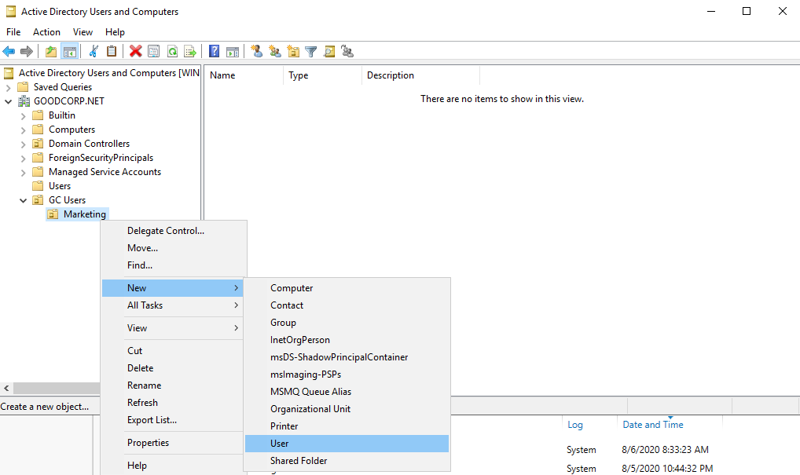

- In this window, enter `Caroline` for the first name and for the user logon name.

   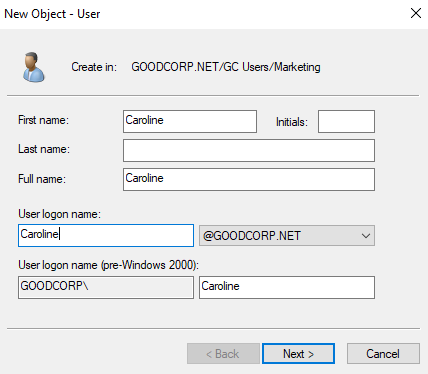

Explain the various fields you can enter for a user. Let students know that some organizations choose to use the last name initial, first name as the user account.

- To make it simple, and because our own domain won't be nearly as large as our clients', we are going to just use first names as the username, followed by @GOODCORP.NET.

- Click **Next >**.

The next screen will have fields for setting Caroline's password and a few password settings for sysadmins to set.

- Set the password to `Ilovemarketing!`.

- Uncheck **User must change password at first logon**.

- You don't have to check any other boxes here.

Let students know that in a real world scenario, we would have our user reset their password on their first logon. We are keeping the names the same so we can test the user later. (Also so the class doesn't forget what they change the passwords to).

- Click **Next >**.

- The next screen shows you the settings you chose. It should have the following:

  - Full name: `Caroline`
  - User logon name: `Caroline@GOODCORP.NET`

- Click **Finish**.

- Double-click on the **GC Users > Marketing** organizational unit (the folder icon), and point out our newly created user, `Caroline`, in the right pane.

  - 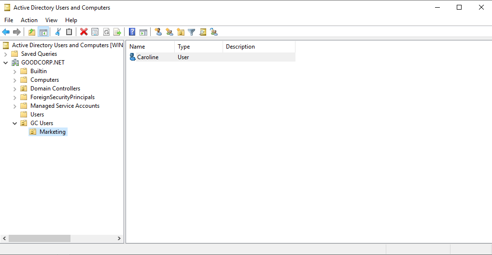

Now that we have Caroline's domain account set up, we're going to add her to a group.

Take a moment to run a comprehension check poll and address any questions before moving on. 

### Creating Groups

Reiterate that groups are collections of objects that require authorization to access resources.

Explain that groups are different from organizational units in the following ways:

- You can link group policies to OUs, but not groups.

- You can give file, folder, sharing, and other resource permissions to groups, but not OUs.

- Groups have security identifiers, but OUs do not.

Summarize that groups are for managing permissions to resources, while organizational units are for linking policies to a set of objects, and for administration purposes. We'll be exploring Group Policies soon.

Specify that users can belong to many groups, but are only part of one OU. OUs are organizational tools.

- For example, the `Caroline` domain account belongs under the `Marketing` organizational unit, but the user `Caroline` can be in the `Salesforce` _and_ `Customer Service` groups.

- The groups allow Caroline access to `Salesforce` and `Customer Service` resources such as networked file shares, while, the `Marketing` OU will have the `Marketing` Group Policies applied to these accounts. 

   - A policy might be "no access to Windows control panel," meaning users in the `Marketing` OU won't be allowed access to Windows control panel to change system settings.

With ADUC still open, complete the following steps:

- Right-click the **GC Users > Marketing** OU, then go to **New**, then **Group**.

- Set the group name to `Marketing`. Leave group scope as **Global** and group type as **Security**.

   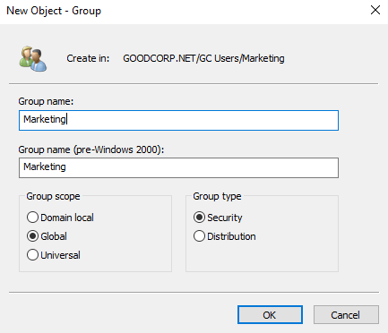

- Briefly discuss scopes:

  - Universal groups exist in the domain forest. If we also own the domains GoodCorp.com and BadCorp.net and they share a transitive trust relationship, user accounts in universal groups can use resources in all of these domains.

  - Global groups are set up to contain multiple users with identical permissions. Global groups are usually lists of users.

  - Local groups are best used when their objects only need access to specific resources.

- Click **OK**.

A new group, `Marketing`, will appear in the `GC Users > Marketing` organizational unit. Remind students that we need to add `Caroline` to `Marketing` now.

  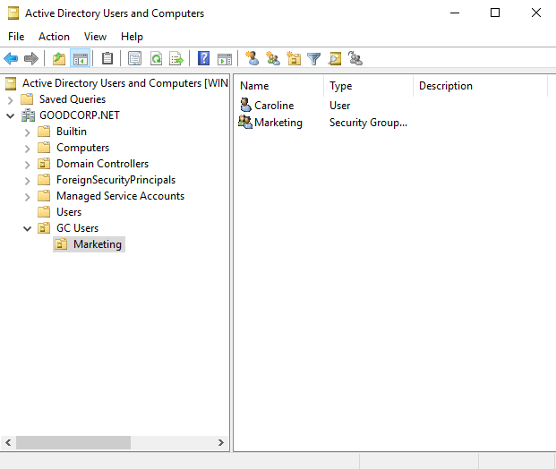

- Right-click **Caroline** and go to **Add to a group...**.

  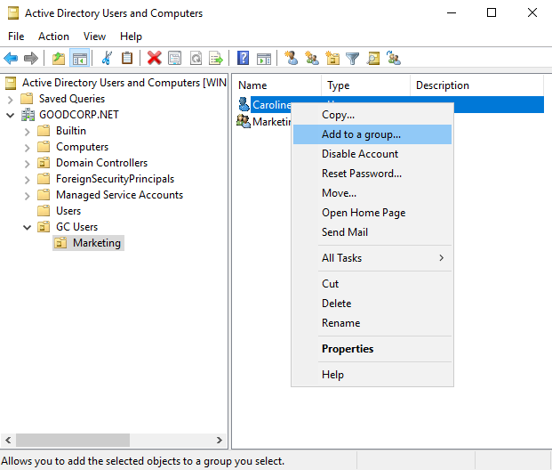

- In Select Groups, type "Marketing" in the **Enter the object names to select** field.

  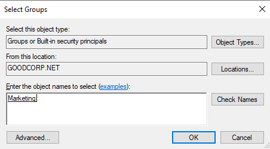

- Click **Check Names**.

  - "Marketing" becomes underlined, meaning the system found the group.

- Click **OK**. A new screen will appear saying `The Add to Group operation was successfully completed.`

  
- Click **OK**.

Tell students that `Caroline` is now part of the `Marketing` group in our domain. Later, we will set up the `Marketing` group permissions.

## Demo: Creating Group Policy with Group Policy Objects

**Heads Up**: You must have completed the previous activity review in order to complete this demo. We will be using the `Sales` group instead of the `Marketing` one for this demo.

We set up users and their associated OUs and groups, and can now create some policies that will distinguish them from one another.

- We use Group Policy Objects to implement the principle of least privilege, giving users only the access they need, in order to keep a threat's attack surface area as small as possible. 

  - For example, we can use a Group Policy Object to deny `Sales` access to Control Panel, since members of the Sales team don't need to access this area of the system. 

- Group Policies manage and apply multiple policies at the same time. One change to a Group Policy can take effect on all the OUs the policies are applied to.

  Consider the following scenario: 

  - Recently, all of the accountants at your company had their passwords leaked. 

  - After securing the vulnerability that was exploited, you can assign the accounting OU, which consists of over 1,000 accounts, a policy that resets all users' passwords and requires every accountant to set a new password on their next logon. 

To pass a Group Policy to an OU, we need a Group Policy Object.

- A Group Policy Object (GPO) is a package of policy settings applied to OUs in our domain. GPOs are the cornerstone of policy management in Active Directory.

- Multiple Group Policies are often combined into one GPO. 

    - For example: If you want to not only require accountants to have password complexity requirements, but also to deploy an anti-malware software the next time they log on, you can combine these two policies into one Group Policy Object called `Better Password and Anti-Malware Setup`, and apply it to all the accountants in the OU.

### Creating Group Policy with Group Policy Objects Demo

For this demo, want our Sales team to have limited access to Windows Control Panel. 

Emphasize that this week's homework will largely involve GPOs and that if they get lost, a good idea would be to have them ask TAs for help. It can help to check-in and ask students how they are understanding the material.

Control Panel allows a user to change vital system settings on their machine, and as such, we are concerned that members of the Sales team might make mistakes if they try to troubleshoot problems on their own.  

In this demo, we will deny the Sales team access to the Control Panel. 

In order to do this, we will need to: 

- Create a Group Policy Object.

- Edit the individual policies for our Group Policy Object

- Link the Group Policy Object to an organizational unit.

- Within the Windows 10 machine, pull the latest Active Directory changes.

- Then finally, see if the GPO worked.

### Create New Group Policy Object

Make sure that you're working in the **Windows Server machine** before continuing.

Begin by opening the Group Policy Management tool.

- With the Server Manager open, click on **Tools** at the top-right.

- Select the **Group Policy Management** tool. The Group Policy Management window will appear.

  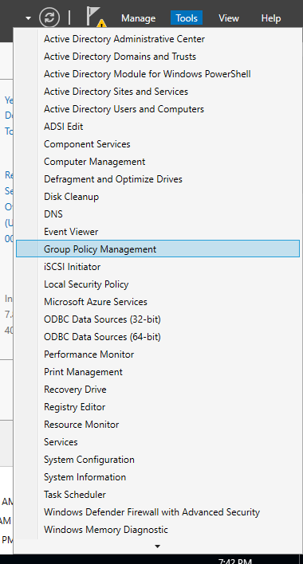

Point out that the left pane of the Group Policy Management window looks similar to where we saw our domain and organizational units.

Click on the following:

- In the Group Policy Management window, click on **Forest**. Move through **GOODCORP.NET** > **Domains**>  **GOODCORP.NET**. 

   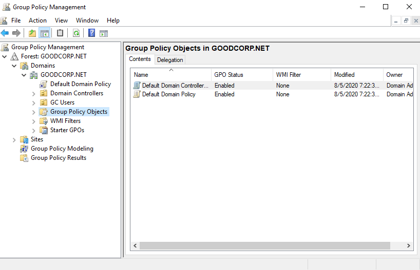

- Right-click **Group Policy Objects** under **GOODCORP.NET** and click **New**.

   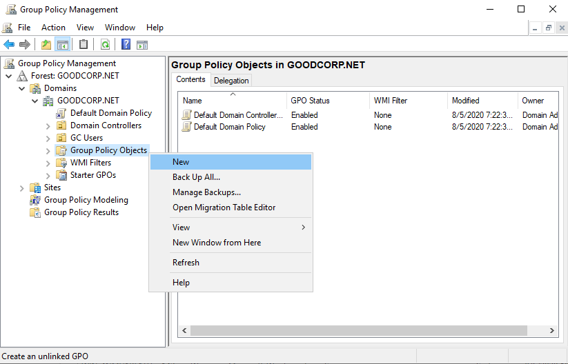

In the New GPO window, type "No Control Panel" for the name.

- Click **OK**.

- Point out the new `No Control Panel` GPO under the defaults in the Group Policy Objects list on the right-side pane.

   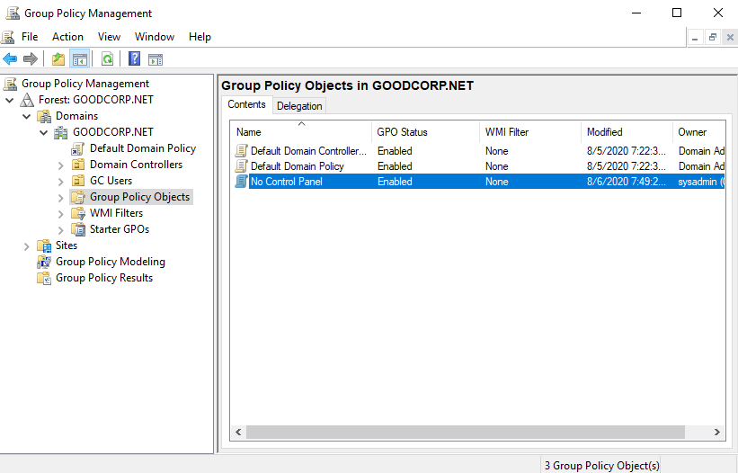

### Add Group Policies to Group Policy Object

We just created a Group Policy Object. But, it doesn't have any policies to enforce yet. We'll look at how to do that now.

- Right-click the **No Control Panel** GPO and click **Edit**. The Group Policy Management Editor window will open.

Explain that this is where you select the policies to add to your GPO.

- Navigate to **User Configuration**, then click **Policies** >  **Administrative Templates** > **Control Panel**. On the right-side pane are default policies you can edit.

  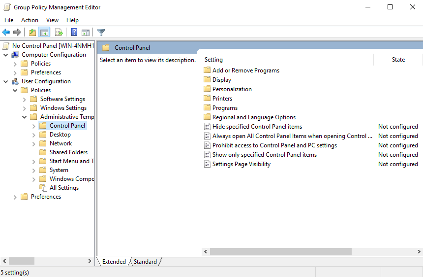

- Double-click the **Prohibit access to Control Panel and PC settings** policy. It will open the Prohibit access to Control Panel and PC settings window.

Tell students that this is the policy to deny access to the Control Panel on Windows systems.

- Select **Enable**, then press **Apply** > **OK**.

  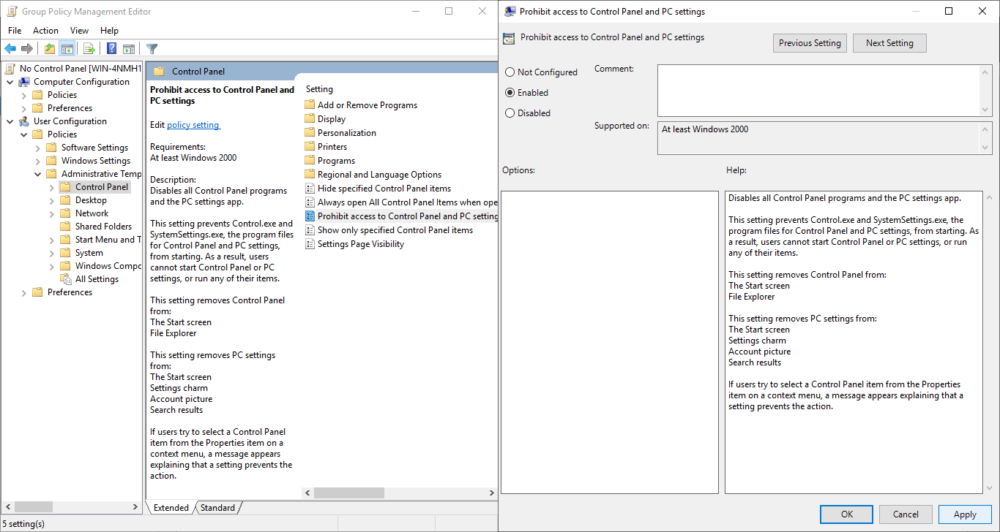

- Close the Group Policy Management Editor window.

### Link and Apply the Group Policy Object

At this point, we have created a Group Policy Object with a single policy that denies access to the Control Panel. Now we need to apply it to the Sales team OU, which will acquire GPO links. 

Navigate to the Group Policy Management window so that we can link the Group Policy Objects to the organizational unit. 

- With the Group Policy Management window open, move through the following: **Group Policy Management** > **Forest** > **Domains** > **GOODCORP.NET** > **GC Users**. 
  
- Right-click the `Sales` Organizational Unit under `GC Users` and select `Link an Existing GPO...`. The `Select GPO` window will appear.

  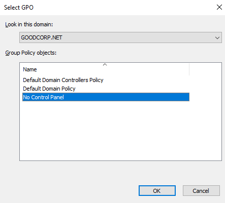

We can now apply the `No Control Panel` GPO we created.

- Click **No Control Panel** and click **OK**.

We have now applied the `No Control Panel` GPO to the `GC Users > Sales` Organizational Unit.

  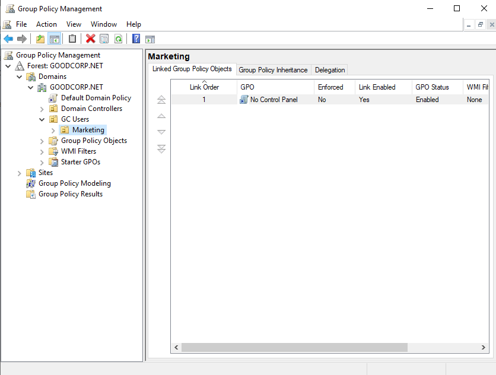

### Toggle Enhanced Session Mode to Basic session and Test GPO

Now we'll want to log in as `Bob` in our Windows 10 machine to see our changes. But first, we need to pull the latest Active Directory changes to the machine.

- Go back to the Windows 10 machine. Sign in as `sysadmin` if you are not already.

Explain that we're going run the command `gpupdate` on the Windows 10 machine so that it pulls and refreshes the latest group policies.

- Open a CMD or PowerShell window and run `gupdate`. You should see the following:

  ```
  Updating policy...

  Computer Policy update has completed successfully.
  User Policy update has compelted successfully.
  ```

This means our machine has now pulled the latest group policies. 

Now we'll want to swap the Windows 10 machine to **Basic session** mode if it is not already.


Note that the Windows Azure Lab should already be configured so that the virtual machines have **Enhanced Session Mode** enabled by default. 

**Enhanced Session Mode** allows you to copy and paste directly into the virtual machines. You won't, however, be able to log into the virtual machines as a domain user with **Enhanced Session Mode** enabled.

Toggling the Windows 10 virtual machine to **Basic session** mode will allow us to log into our domain user in the Windows 10 machine.

- Click on the button pictured below to toggle the virtual machine into **Basic session** mode. If you hover your mouse over the button, you’ll be able to see which mode you are toggling to.

  - 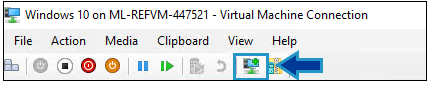

After toggling to **Basic session**:

- Once you're signed out of `sysadmin` you should be back at the Windows lock screen, click it, then select **Other user**.

- Enter `Bob` and `Ilovesales!` for the **User name** and **Password**.
  
 **Note** that once you are done using your domain user, you can toggle **Enhanced Session Mode** back on, which will return you to the login screen and allow copy and pasting into the VM again.

You should see the first-time Windows 10 login messages, such as `Hi` and `We're getting everything ready for you`. After a few seconds, you should be on `Bob`'s desktop.

- Click on the Start menu or the search bar and type "Control Panel." 

  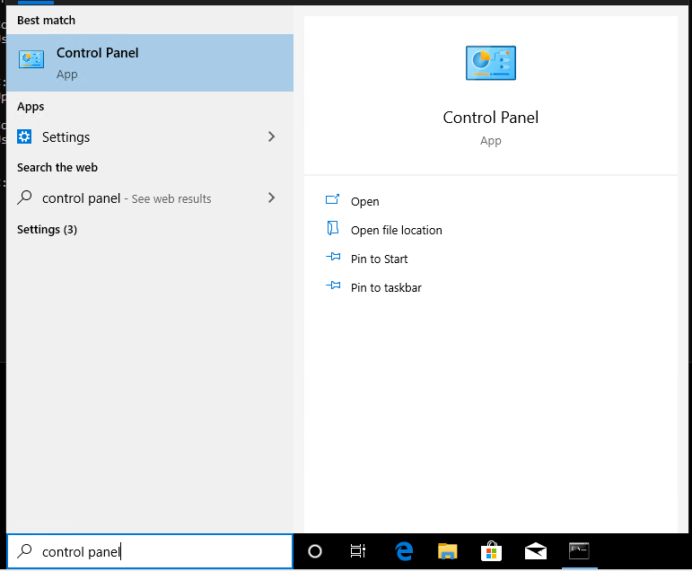

Explain that we should not be able to access the Control Panel as `Bob`.

- Press Enter to see the following Restrictions warning:

  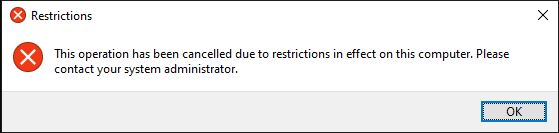

Let students know that if they want to swap back to the _LOCAL_ `sysadmin` user they'll want to sign out of `Bob`, then at the **Other user** login area, enter:

`.\sysadmin` as the username to log in with. The `.\` specifies logging into a local account.

Let students know that for their next activity, they will need to create Group Policy Objects with policies and link them to the proper organizational units.

### 10. Instructor Do: End Day and Shut Down Virtual Machines and Lab (0:05)

Reiterate that Group Policy Objects are a way to manage and apply policies to entire sets of users or groups all at once.

Summarize to students that while it took some time to get here, learning how to manage users and computers with Group Policy Objects is a vital part of understanding how to be an Active Directory domain system administrator and to create policies that can enforce security.

Answer any questions before ending class.

| :warning: Shut Down Your Machines :warning: |
|:--:|
| Remind everyone to shutdown their Hyper-V virtual machines and Windows RDP Host machine. They will need the remaining hours to complete their homework. |

---
© 2020 Trilogy Education Services, a 2U, Inc. brand. All Rights Reserved.
