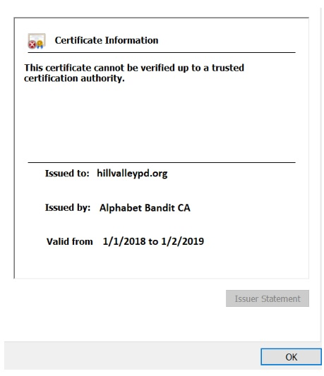

## Activity File: SSL Certificates

You will continue your role as a security analyst working for the Hill Valley Police Department. 

- Several of your fellow officers have received a suspicious email saying that their Hill Valley Police website account had expired and asking them to log in to update their account.

- One suspicious detail is that the website linked in the email is hillvalleypd.org, but the website that officers usually access is hillvalleypd.com.

- Captain Strickland has tasked you with investigating the suspicious website and checking the certificates to determine if the website is legitimate.

### Instructions

1. Access the [website that was sent to several Hill Valley officers](https://view.genial.ly/5defb03224596c0fff13c3a2/interactive-image-interactive-image).
                                
2. Click on the purple icons on each page to view the SSL certificate information. 
    - Note: Clicking the purple house on each page will take you back to the homepage. 

3. Answer the following questions:

    - What is the root certificate for this website?
    - What is the intermediate certificate for this website?
    - Why is the browser giving a warning about the certificate?

4. Provide a summary to your captain about your findings and recommend what should be communicated to all the Hill Valley PD staff.

## Solution Guide: SSL Certificates 

This activity showed how SSL certificates can assist with the authentication of a website.  You explored a mock website's SSL certificate and learned how even if a site has a certificate, it can still be inauthentic.

---

1. Access the [website that was sent to several Hill Valley officers](https://view.genial.ly/5defb03224596c0fff13c3a2/interactive-image-interactive-image).
                                
- First, open [the webpage that was sent to the officers]( https://view.genial.ly/5defb03224596c0fff13c3a2/interactive-image-interactive-image).
      
    - Remember, the officers found this website suspicious because the official website is hillvalleypd.com.
 
2. Click on the purple icons on each page to view the SSL certificate information. 
    - Note: Clicking the purple house on each page will take you back to the homepage. 

 - View the certificate of the website. To do this, click on the purple icon next to the website.
 
    
 
 - There is a clear warning of an issue with certificate and the website.
 
    
  
  - To further view the details, click on the purple icon next to **Certificate (Invalid)**.
  
  - This displays the certificate details header, with several tabs available for viewing.
  
  - Begin by viewing the **General** tab.
  
    
  
  - Also, the certificate is expired.
  
    
   
- Close this page by clicking the **x**. Click on **Certification Path**.
   
    
   
3. Answer the following questions:

    - What is the root certificate for this website?
    - What is the intermediate certificate for this website?
    - Why is the browser giving a warning about the certificate?

- This clearly shows that while a certificate was issued, the issuing root authority's name is highly suspicious:
   - No Verification Certificate Authority 
- The intermediate certificate authority name is also suspicious: 
   - Alphabet Bandit Certificate Authority
           
            
           
  - What is the root certificate for this website?
      -  No Verification Certificate Authority

  - What is the intermediate certificate for this website?
      -  Alphabet Bandit Certificate Authority

  - Why is the browser giving a warning about the certificate?
      - Because the root issuing certificate authority is fraudulent, and not in the browser's root store.
   
4. Provide a summary to your captain about your findings and recommend what should be communicated to all the Hill Valley PD staff.

- Sample summary and recommended communication:
   
   - "Captain Strickland, I have determined that the emails our detectives have been receiving are phishing emails. The website hillvalleypd.org is fraudulent, and while it has a certificate, it was issued by an illegitimate root and illegitimate intermediate certificate authority. 
   
      I recommend we provide a warning message bulletin to all of our staff to be aware of all suspicious emails and websites, and to verify if certificates are legitimate on any website being accessed. Also, don't forget to digitally sign your message."
  ---

   © 2020 Trilogy Education Services, a 2U, Inc. brand. All Rights Reserved.
