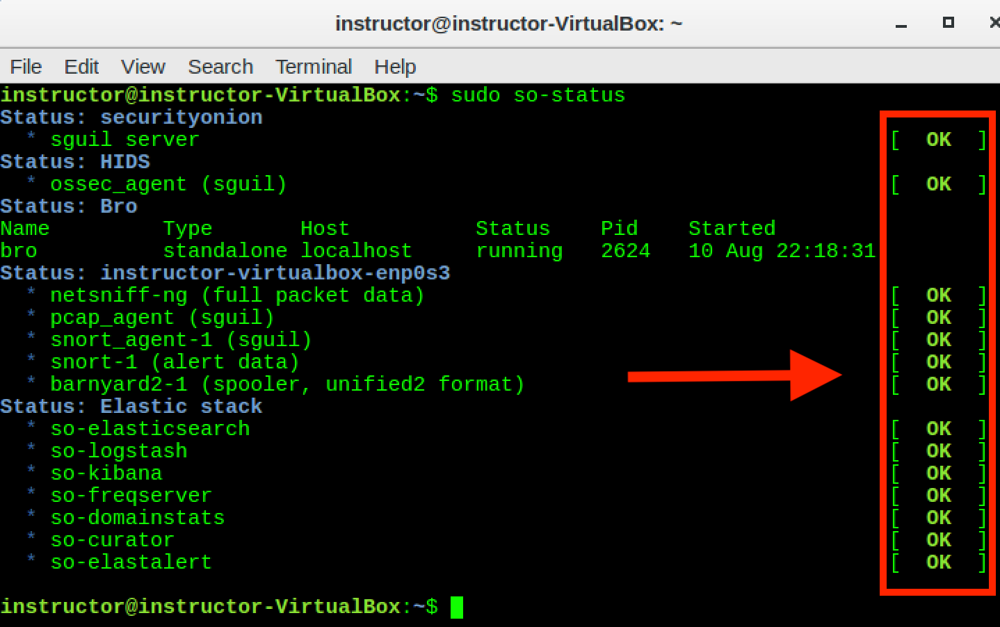
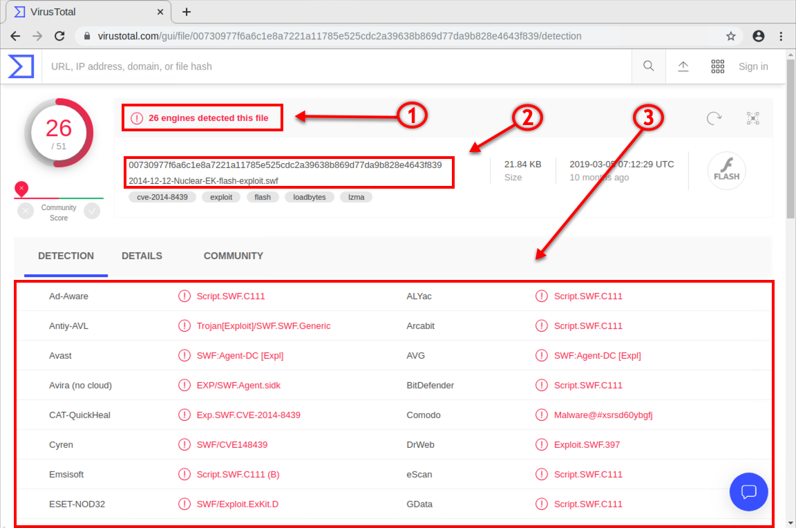

# 11.2 Lesson Plan: Intrusion Detection, Snort, and Network Security Monitoring

## Instructor Notes

- On Days 11.2 and 11.3, we will begin class by logging into Azure and launching an instance of Security Onion. This will generate PCAP traffic that we will use to analyze and triage alert data.

## Lab Environment

Lab Details

In this unit, you will be using the NetSec lab environment located in Windows Azure Lab Services.  RDP into the **Windows RDP host machine** using the following credentials:

  - Username: `azadmin`
  - Password: `p4ssw0rd*`

Open Hyper-V Manager to access the below machines:

**Security Onion machine:**
  - Username: `sysadmin`
  - Password: `cybersecurity`

**UFW machine:**
  - Username: `sysadmin`
  - Password: `cybersecurity`

**firewalld machine:**
  - Username: `sysadmin`
  - Password: `cybersecurity`

In today's class, you will use the SecOnion machine.

## 01. Everyone Do: Security Onion Setup (0:10) 

Welcome students to class and let them know that today's lesson will introduce fundamental concepts and tools of network security monitoring, intrusion detection, and Snort.

Before we get started, we will need to log into Azure and launch an instance of Security Onion. This will generate alert data that we'll use later in the class. Specifically, it will spin up an instance of Security Onion with loaded PCAPs.

- Review that PCAPs are snapshots of live traffic. In the networking units, students loaded PCAPs into Wireshark. 

- Explain that, Security Onion will use the command `sudo so-replay` to replay multiple PCAPS stored in the `/opt/samples` directory, which stores hundreds of PCAPs. 

- It's essential, that network defenders know how to replay network traffic using PCAPS in order to analyze and triage alert data.

Send students the following file: 

- [Everyone Do: Security Onion Setup](Activities/01_Security_Onion_Setup/README.md)

Lead the class in the following demonstration.

1. First, we will all verify that our network security monitoring (NSM) tools are working before starting the labs. Click on **Applications** > **Other** > and scroll down to **Terminal**. Click to launch the terminal type the following command:
   
    - `sudo so-status`
      
       - `so-status`: Checks the status of currently installed NSM tools.
   
    - Output should look similar to below:
   
       
   
      - Ensure all statuses are listed as `OK`.
      - If not, let the `so-status` command run for a few minutes. It can be slow.
   
    - If any of the statuses are not listed as `OK` after a few minutes, restart the NSM tools with the following command:

       - `sudo so-restart`
   
    - Run the `so-status` command again for a few minutes. All systems should be listed as `OK` after a few minutes.

2. Next, we need to generate alerts.  

   - Run `sudo so-replay`

      - `so-replay` is the command used by Security Onion to "replay" all PCAP files from previously captured malware.

It can `so-replay` take as long as 10 to 15 minutes for Security Onion to run all of the PCAPs. This will be running as we move into the first lecture. By the time we reach our first activity, the PCAP replay should be completed and Security Onion should be ready to go.

### 10. Instructor Do: Alert - FTP File Extraction (0:15)

Explain that there will be many times when an alert requires an analyst to do some data mining. A security analyst must have a thorough understanding of how NSM tools are integrated in order to do this. These skills help speed up incident and response efforts.

In the following walkthrough, we will explore the Security Onion interface, using Sguil as the starting point for learning other NSM tools for security investigations.

:warning: **Heads Up**: The IP addresses used in the demos and activities need to be treated as prototypical rather than literal. The actual IP addresses will need to be determined before starting the exercises.

#### Security Onion Demo

The first thing we will do is search using a filter for the IP address from the indicator of attack (IOA).

Launch an instance of Security Onion. Do the following steps:

- Click the Sguil desktop icon and launch the application.
  
- When prompted, select **both** networks to monitor. 
  
- Click **Query** in the top toolbar.

- Click **Query by IP** in the dropdown menu.

   

Next, input the IP address that we obtained from the IOA alert:

- Enter the IP address obtained from the alert: `128.199.52.211`.

- Click **Submit**.

  

Now, we will only see information related to our filtered alert data, as seen below.

1. Alert information: 
   - NSM sensor that triggered the alert.
   - Source and destination IP.
   - Source and destination port.
   - Date and time of the alert.
   - Event message (defined in the Snort IDS rule option used to generate the alert).

2. Reverse DNS lookup information.

3. Snort rule that triggered the alert.

4. Server response message in the packet data section.

   

Since we've now compiled critical information from the attack signature, we have a partial picture of the attack profile. Let's continue our network forensic investigation.

Point out that from the information we've gathered so far, we can conclude the following:

- This attack occurred as the result of a **drive-by** attack that used the HTTP protocol. 

   - A drive-by attack is when a user navigates to a webpage that has built-in malicious scripts running in the background. 

   -  Drive-by attacks are dangerous because the user doesn't need to click anything on the webpage to launch the attack. The mere act of opening the webpage creates a session in the background without the user knowing, which prompts malicious software downloads. 

- Now that we have this knowledge, we know we must search for any files that may have been downloaded to this particular host (the victim).

- Next, we'll introduce a new forensic tool that can extract any files that were installed on the user's machine, and provide us with an attacker profile.

#### NetworkMiner

Explain that NetworkMiner is an NSM tool that's included as part of the Security Onion NSM suite of tools. 

   - NetworkMiner performs advanced network traffic analysis (NTA) of extracted artifacts, and presents them through an intuitive user interface. 

From our Sguil window, we will switch to NetworkMiner by following the steps below. 

**Instructor Note**: Details may vary slightly from screenshot but the concepts still apply.

 Sort the alert IDs from low to high by clicking on **Alert ID** at the top of the column. Right-click on the first Alert ID at the top. 

- Click on **NetworkMiner** in the dropdown menu.

- Now we are presented with NetworkMiner's interface. Pay attention to the tabs at the top. We'll focus on the **Files** tab next.

- Select the **Files (4)** tab as seen in the screenshot. This tells us that NetworkMiner was able to extract and reconstruct the four files used in the attack, from Security Onion's PCAP captures.

- Source port and protocol used (Box 3).

- Protocols used during transmission (Box 4).

- Right-click on one of the files.

- Click on **Open folder**.

- This will open the folder on the local hard disk where NetworkMiner stores the recompiled files.

- Next, open the Chromium Web Browser, navigate to www.virustotal.com, and select **File**.

- Explain that these are parts of the malware. We can click and drag on any one of the files and get results. Drag the `d10.octet-stream` file to the **Choose file** box in the VirusTotal window.

Explain that this opens the VirusTotal search tool, which will attempt to match these files to any known malware signatures.

- Point out that VirusTotal returned the number of matches it discovered for well-known virus engines against this particular file.

- Explain that VirusTotal hashes the files, which establishes a malware signature used to look for a match and determine the common name for the malware.

- Point out that VirusTotal lists all of the common names for this specific malware.

Emphasize that security professionals, especially security researchers, use this website frequently when performing malware analysis and establishing the tactics, techniques, and procedures used by adversaries to infiltrate networks. This information contributes to what is commonly referred to in the industry as an "attacker profile." These help us know our enemies in order to better defend against future attacks.

