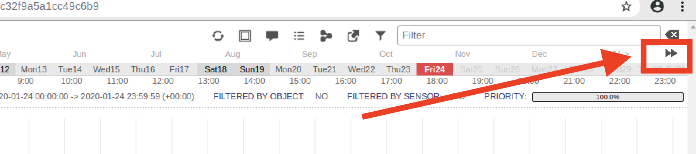
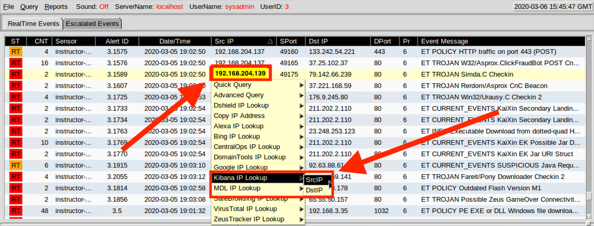

# 11.3 Lesson Plan: Enterprise Security Management (ESM)

## Security Onion Setup

Like the previous class, in preparation for the labs, everyone will need to log into Azure and connect to the Network Security environment. After you are connected, launch an instance of Security Onion from the HyperV manager. This will generate alert data that will allow everyone to complete the labs.

Send students the following file: 

- [Activity File: Security Onion Setup](Activities/01_Security_Onion_Setup/README.md)

Log into the Security Onion machine with the following credentials:

- Username: `sysadmin`
- Password: `cybersecurity`

Lead the class in the following demonstration.

1. First, we will all verify that our network security monitoring (NSM) tools are 100% operational before starting the labs. Launch the terminal.

   - Run the following command to check the status of currently installed NSM tools.

      - `sudo so-status`

   - Output should look similar to below:

      

   - Ensure all statuses are `OK`.
   
   - If not, repeat the `so-status` command a few times. Sometimes it's slow.
   
   - If any of the statuses are not `OK` after a few minutes, restart Security Onion's NSM tool with the following command:

      - `sudo so-restart`
   
   - Keep running the `so-status` command for a few minutes. All systems should reflect `OK` after a few minutes.

## Generate Alerts

2. Next, have the students log into Sguil to verify that their PCAPs are still populated. Remind students that their Sguil login credentials are:

   
   - Username: `sysadmin`

   - Password: `cybersecurity`

Verify that students still have their pcaps loaded from the previous class. If this is not the case for anyone, have them run the following command to replay all PCAP files from previously captured malware:

- Run:`sudo so-replay`

- Emphasize that it could take as long as 10 to 15 minutes for Security Onion to run all of the PCAPs.

Once everyone's machines are set up, move on to a brief review and introduce today's topics.

## Investigation, Analysis, and Escalation Demo

**Heads Up**: Each PCAP may not be imported in its exact sequence from the previous session. Therefore, the alert IDs in your demo may vary from the screenshots in this lesson plan. 

Explain that in this demo we will discuss using several tools in the ELK stack. We will focus on how these tools work, and not a specific attack. 

- We will also focus on the process of escalation within a Security Operations Center:

   - Point out that a junior analyst working in a Security Operations Center will belong to a multi-tier group of analysts. Junior analysts typically perform the initial triage of alerts and then escalate these events to senior incident responders.

- This process and the tools involved will be our focus.

We'll begin our investigation with a new tool called Squert:

- Click on the Squert desktop icon and enter the same credentials you used for you Sguil login.

- After logging in, we may need to change the date range to ensure we see all the alert data in our system. Click on the date range as illustrated below.

   

- The default view shows alerts from today. In order to show older alerts, click **INTERVAL**, then click the **two right arrows** to set your custom date. 

   

In this example we'll change the year to 2014 in the **START** field. This date range should cover all alerts used in the PCAPs.

-  Click on the **circular arrows** to reload the web page and refresh the alert data for the newly selected date range.

   

- Next, click on the word **QUEUE** to arrange the priorities from the highest count to the lowest. It may require two clicks.

   

- Explain that clicking on a red number box will drop down that line and reveal several important items.

   - We can see URL links to two websites that provide additional insights into the attack.

   - As security administrators, we can use this research later in our incident investigations. It's encouraged to accumulate information from several different resources.

   

- The screenshots below show the articles found at the links.

   - The articles, written by two different security researchers, provide incident responders with different insights into the same attack.

   

   

- Click on the **Views** tab at the top.

   - Explain that the Views tab displays traffic as it flows between a source and destination IP.
   
   - Scroll down to see more. 
   
   - Thicker bands indicate higher volumes of traffic.

   - This visualization indicates to security administrators potential problem areas that may require further investigation.

   

- Hover the mouse over a band and a window will pop up displaying the flow of traffic between source and destination IP using directional arrows.

   - The number of transmissions that have occurred is also displayed.

   

- Explain that next we'll use Elastic Stack's data analytics engine through Kibana's web-based visualization tool. 

- Minimize the Squert window and open Sguil.

Launch Kibana by doing the following:

   - Right-click on any IP address.

   - A dropdown menu will appear. Select **Kibana IP Lookup**, and then select either the destination (**DstIP**) or source IP (**SrcIP**).

   

- After Kibana launches, you may be prompted to log in. If so, log in with the same credentials used for the Sguil client.

  - Once the web browser launches, it's best practice to verify that Kibana is using the correct filter, as seen in the screenshot below.

   - The IP address in the Kibana filter should match the one that we right-clicked to pivot from the Sguil client. In this case, it matches the IP that we used for this pivot, which is good.

   

- Explain that we have now started using the powerful Elastic Stack data analytics engine.

   - Remind students that Elastic Stack is the heart of Security Onion's enterprise security monitoring capabilities. Kibana is the interface that provides insight into endpoint telemetry by interpreting the OSSEC agent syslog data.

In this next example, we'll begin our investigation by scrolling down to the **HTTP - Destination Ports** section.

- At this point in an investigation, we are looking for non-standard HTTP ports.

   - For example, if we saw port `4444` indicated here, that would be a clear indicator that a Metasploit Meterpreter session was in progress.

    

Scroll down to the MIME word cloud.

- Explain that **MIME** (Multipurpose Internet Mail Extension) types (not a file extension), are used by browsers to determine how URLs are processed.

   - Therefore, it is important that web servers use the correct type of MIME.

   - Incorrectly configured MIME types are misinterpreted by browsers and can cause sites to malfunction and mishandle downloaded files.

   - Attackers use this to their advantage.

- Point out that in the graphic below, the Elastic Stack data analytics engine is displayed through Kibana's **MIME - Type (Tag Cloud)** visualization window.

   - The more a MIME type is discovered, the larger it appears in the word cloud.  

   

- If we scroll down a little further, we see **HTTP - Sites**, which lists the number of times particular websites have been visited. This is a good place to look for suspicious websites.

   - The **HTTP - Sites Hosting EXEs** section lists websites that were used to either download or search for an EXE. Again, anything that looks malicious will require further investigation.

   

- To investigate a malicious website, we apply a filter by hovering our mouse over the count and clicking the **+** sign. This will filter out all other websites.

- In the graphic below, the arrow pointing to the left will drop down the contents of the selected log, revealing its contents.

   - The arrow pointing to the right is the hyperlink to the PCAP file.

   - Clicking on this link will launch the PCAP in another window and display the TCP conversation using either TCP or HTTP flow.

   

- Now, using the image above as an example, click on the **triangle arrow pointing to the right**.
   - This will drop down the log file and reveal its contents, as shown in the screenshot below.  

   

   - In our screenshot example, we can see the message `A Network Trojan was detected`, as indicated in the `classification` field.

   - We can also see that the `event_type` is indicated as `snort`.
      - An event type is the source of the alert, i.e., the application that generated the alert.

      - This entry is the result of an endpoint Snort IDS engine alert.

- Scroll up and click the link under **_id**. Explain that we can see the PCAP pivot. We can learn three facts from this view: 
   - The configuration is set to IDS and not operating in IPS mode. A download _could_ have occurred.  
   - We can see the HTTP response **SRC: Connection: Close**, meaning it closed when the victim got to this page. 
   - We can also see an **error 302**, meaning the website had moved.

   From this we can assume the following likely happened:
     - The victim clicked on a malicious link.
     - The link opened a window which downloaded or attempted to download the trojan.
     - The window quickly closed itself.

   Further analysis is required.

- Explain that once we determine an alert needs further analysis, we will escalate the event to a senior incident handler for further review.

   - Return to your Sguil window.
   - Right-click **RT** in the status column.
   - Select **Update Event Status**.
   - Select **Escalate**.
   - Add a comment: "Trojan may have been downloaded."
   - Click **Okay**.

 Note: This will move the alert from the Real Time alerts queue to the Escalation queue.

We can verify the escalated event by:

- Selecting the **Escalated Events** tab.

- Right-clicking on the event.

- Selecting **Event History**.

- Verifying the note that was entered by the junior analyst.

#### Summary

- This demonstration taught students how to conduct investigations using various threat hunting techniques. We focused on a few of the many ways to start an investigation.  

- ESM (enterprise security monitoring) includes endpoint telemetry, host-based monitoring of system data that uses OSSEC collection agents to gather syslog data.

- To investigate network-based IDS alerts, security administrators must use enterprise security monitoring, which includes visibility into endpoint OSSEC agents.

- IDS alerts are snapshots in time. They raise questions that need answers. With the use of Security Onion, security admins can use PCAPs to reconstruct a crime.

---

© 2020 Trilogy Education Services, a 2U, Inc. brand. All Rights Reserved.
