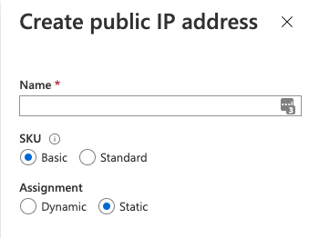

## Activity File:  Virtual Computing

- In our previous activities, we set up a secure VNet inside a resource group for the Red Team.

- In this activity, you will launch 3 new virtual machines to be used throughout the cloud portion of the course.

- To keep your connections to these machines secure, you want to only connect using SSH keys.

- You are tasked with setting up 3 new Ubuntu VMs inside the Red Team resource group to be used throughout the cloud section of the course.
	- A Jump-Box and 2 web servers.

### Instructions

#### VM 1 - The Jump-Box
Create a new VM. Configure it with the following properties:
- The **Name** should be "Jump-Box-Provisioner."

- It must be created in the Red Team resource group.

- It must be located in the **same region** as your resource and security groups.
	- Note that availability of VMs in Azure could cause you to change the region where your VMs are created.

- Choose an administrative username that you can remember easily. We recommend `azdmin`. 
  - You should use the same admin name for all 3 machines.
  - Make sure to take a note of this username, as you will need it to login later.

- You will need to create a new SSH key for remote connections. Note that you are using an SSH key _instead_ of setting a password.
	- **Note:** Windows users should use [GitBash](https://gitforwindows.org/) to create ssh keys and ssh connections.
	- Use `ssh-keygen` to generate SSH keys and `ssh` to open SSH connections.

- Choose the VM Size option that has the following properties:
  - **Offering** is **Standard - B1s**
  - 1 CPU
  - 1 GB RAM

In the **Networking** settings: 

- Make sure your new VM is assigned to your security group.

- Make sure this Jump-Box machine has a _static_ public IP address. 

#### VMs 2 and 3 - The Web VM's

Create 2 more new VMs with the following properties:
- Each VM should be named "Web-1" and "Web-2"

- Each VM must be created in the Red Team resource group.

- Each VM must be located in the **same region** as your resource and security groups.
	- Note that availability of VMs in Azure could cause you to change the region where your VMs are created.

- Choose an administrative username that you can remember easily. We recommend `azdmin`. 
  - You should use the same admin name for all 3 machines.
  - Make sure to take a note of this username, as you will need it to login later.

- You will need to use an SSH key for remote connections. Note that you are using an SSH key _instead_ of setting a password.
	- For these machines, use the `ssh` key that you created for the first machine.
  - Run `cat ~/.ssh/id_rsa.pub` to get the public key you need.
  - Note that this key will need to be changed later, so for now, we are just setting it up with a key to get it created.

- Choose the VM option that has:
  - Whose offering is **Standard - B1ms**
  - 1 CPU
  - 2 RAM
  - **Note:**: These web machines should have 2 GB of RAM and the Jump-Box only needs 1 GB. All 3 machines should only have 1 vCPU because the free Azure account only allows 4 vCPU's in total per region.

It is **crucial** to make sure both of these VM's are in the same availability Set. Follow the steps below:
  - Under Availability Options, select 'Availability Set'.
  - Click on 'Create New' under the Availability set.
  - Give it an appropriate name, e.g.: "Web-Set". Make sure **both VMs** are in the availability set.
  - Save your changes.


Under Networking:
- Make sure these new VMs are assigned to your security group.

- Make sure these machines _do not_ have public IP addresses. Set the Public IP to 'None' for both.

Note that these machines will not be accessible at this time because our security group is blocking all traffic. We will configure access to these machines in a later activity.

## Solution Guide: Virtual Computing

The goal of this activity was to set up your first virtual machine inside your cloud network, which is protected by your network security group. You will use this machine as a jump box to access your cloud network and any other machines inside your VNet.

---

Remember: Allowing a server to use password authentication for SSH is insecure because the password can be brute forced.

- Therefore, we will only use cryptographic SSH keys to access our cloud servers. Password authentication will not be allowed. 

- This is part of the "ground up" security approach that we have been discussing. 

Open your command line and run `ssh-keygen` to create a new SSH key pair.

- Your output should be similar to:

    ```bash
    cyber@2Us-MacBook-Pro ~ % ssh-keygen
    Generating public/private rsa key pair.
    Enter file in which to save the key (/Users/cyber/.ssh/id_rsa):
    Enter passphrase (empty for no passphrase): 
    Enter same passphrase again: 
    Your identification has been saved in id_rsa.
    Your public key has been saved in id_rsa.pub.
    The key fingerprint is:
    SHA256:r3aBFU50/5iQbbzhqXY+fOIfivRFdMFt37AvLJifC/0 cyber@2Us-MacBook-Pro.local
    The randomart image is:
    +---[RSA 2048]----+
    |         .. . ...|
    |          o. =..+|
    |         o .o *=+|
    |          o  +oB+|
    |        So o .*o.|
    |        ..+...+ .|
    |          o+++.+ |
    |        ..oo=+* o|
    |       ... ..=E=.|
    +----[SHA256]-----+
    ```

Run `cat ~/.ssh/id_rsa.pub` to display your `id_rsa.pub` key:

- Your output should be similar to:

    ```bash
    cyber@2Us-MacBook-Pro ~ % cat ~/.ssh/id_rsa.pub 

    ssh-rsa AAAAB3NzaC1yc2EAAAADAQABAAABAQDGG6dBJ6ibhgM09U+kn/5NE7cGc4CNHWXein0f+MciKElDalf76nVgFvJQEIImMhAGrtRRJDAd6itlPyBpurSyNOByU6LX7Gl6DfGQKzQns6+n9BheiVLLY9dtodp8oAXdVEGles5EslflPrTrjijVZa9lxGe34DtrjijExWM6hBb0KvwlkU4worPblINx+ghDv+3pdrkUXMsQAht/fLdtP/EBwgSXKYCu/
    ```

- Highlight and copy the SSH key string to your clipboard. 

#### VM 1 - The Jump-Box
Create a new VM. Configure it with the following properties:
- The **Name** should be "Jump-Box-Provisioner."

- It must be created in the Red Team resource group.

- It must be located in the **same region** as your resource and security groups.
	- Note that availability of VMs in Azure could cause you to change the region where your VMs are created.

- Choose an administrative username that you can remember easily. We recommend `azdmin`. 
  - You should use the same admin name for all 3 machines.
  - Make sure to take a note of this username, as you will need it to login later.

- You will need to create a new SSH key for remote connections. Note that you are using an SSH key _instead_ of setting a password.
	- **Note:** Windows users should use [GitBash](https://gitforwindows.org/) to create ssh keys and ssh connections.
	- Use `ssh-keygen` to generate SSH keys and `ssh` to open SSH connections.

- Choose the VM Size option that has the following properties:
  - **Offering** is **Standard - B1s**
  - 1 CPU
  - 1 GB RAM

#### VM 1 - Jump-Box

Open your Azure portal and search for "virtual machines."

- Use the **+ Add** button or the **Create virtual machine** button to create a new VM.

    

Use the following settings for this VM: 

- Resource group: Choose the same resource group that you created for the Red Team.

- Virtual machine name: Use the name "Jump Box Provisioner."

- Region: Use the same region that you used for your other resources.
	- Note that availability of VM's in Azure could cause you to change the region where your VM's are created.
	- The goal is to create 3 machines in the same resource group attached to the same security group. If you cannot add 3 machines to the resource group and security group that you have, a new resource group and security group may need to be created in another region.

- Availability options: We will use this setting for other machines. For our jump box, we will leave this on the default setting.

- Image: Choose the Ubuntu Server 18.04 option.

- Choose the VM option that has:
  - Whose offering is **Standard - B1s**
  - 1 CPU
  - 1 RAM

For SSH, use the following settings: 

- Authentication type: SSH public key.

- Username: Create any username you like.

- SSH public key: Paste the public key string that you copied earlier.

- Public inbound ports: Ignore this setting. It will be overwritten when you choose your security group.

- Select inbound ports: Ignore this setting. It will be overwritten when you choose your security group.


In the **Networking** settings: 

- Make sure your new VM is assigned to your security group.

- Make sure this Jump-Box machine has a _static_ public IP address. 

Move to the **Networking** tab and set the following settings:

- Virtual network: Choose the VNet you created for the Red Team.

- Subnet: Choose the subnet that you created earlier.

- Public IP: Choose `Create new` and choose `Static` under Assignment in the side panel. Give the IP Address a unique name.



- NIC network security group: Choose the Advanced option so we can specify our custom security group.

- Configure network security group: Choose your Red Team network security group.

- Accelerated networking: Keep as the default setting (Off).

- In the Networking settings, take note of the VM URL. You may use it later.

- Load balancing: Keep as the default setting (No).

    

- Click on **Review + create**.

    

- Finalize all your settings and create the VM by clicking on the **Create** button.

#### VMs 2 and 3 - The Web VM's

Create 2 more new VMs with the following properties:
- Each VM should be named "Web-1" and "Web-2"

- Each VM must be created in the Red Team resource group.

- Each VM must be located in the **same region** as your resource and security groups.
	- Note that availability of VMs in Azure could cause you to change the region where your VMs are created.

- Choose an administrative username that you can remember easily. We recommend `azdmin`. 
  - You should use the same admin name for all 3 machines.
  - Make sure to take a note of this username, as you will need it to login later.

- You will need to use an SSH key for remote connections. Note that you are using an SSH key _instead_ of setting a password.
	- For these machines, use the `ssh` key that you created for the first machine.
  - Run `cat ~/.ssh/id_rsa.pub` to get the public key you need.
  - Note that this key will need to be changed later, so for now, we are just setting it up with a key to get it created.

- Choose the VM option that has:
  - Whose offering is **Standard - B1ms**
  - 1 CPU
  - 2 RAM
  - **Note:**: These web machines should have 2 GB of RAM and the Jump-Box only needs 1 GB. All 3 machines should only have 1 vCPU because the free Azure account only allows 4 vCPU's in total per region.

It is **crucial** to make sure both of these VM's are in the same availability Set. Follow the steps below:
  - Under Availability Options, select 'Availability Set'.
  - Click on 'Create New' under the Availability set.
  - Give it an appropriate name, e.g.: "Web-Set". Make sure **both VMs** are in the availability set.
  - Save your changes.


#### VM's 2 and 3 - Web VM's

Create 2 more new VMs. Keep the following in mind when configuring these VM's:
- Each VM should be named "Web-1" and "Web-2"

- These VM's need to be in the same resource group you are using for all other resources.

- The VM's should be located in the same region as your resource group and security group.
	- Note that availability of VM's in Azure could cause you to change the region where your VM's are created.
	- The goal is to create 3 machines in the same resource group attached to the same security group. If you cannot add 3 machines to the resource group and security group that you have, a new resource group and security group may need to be created in another region.

- The administrative username should make sense for this scenario. You should use the same admin name for all 3 machines. Make sure to take a note of this name as you will need it to login later.

- You will need to create a new SSH key for remote connections. 
	- **Note:** Windows users should use [GitBash](https://gitforwindows.org/) to create ssh keys and ssh connections.

- Choose the VM option that has:
  - Whose offering is **Standard - B1ms**
  - 1 CPU
  - 2 RAM

**Note:** These web machines should have _2 GB_ of RAM and the Jump-Box only needs _1 GB_. All 3 machines should only have _1 vCPU_ because the free Azure account only allows _4 vCPU's_ in total per region.

**Important:** Make sure both of these VM's are in the same availability Set. Under Availability Options, select 'Availability Set'. Click on 'Create New' under the Availability set. Give it an appropriate name. After creating it on the first VM, choose it for the second VM.


Under Networking:
- Make sure these new VMs are assigned to your security group.

- Make sure these machines _do not_ have public IP addresses. Set the Public IP to 'None' for both.

Note that these machines will not be accessible at this time because our security group is blocking all traffic. We will configure access to these machines in a later activity.

In the **Networking** tab and set the following settings:

- Virtual network: Choose the VNet you created for the Red Team.

- Subnet: Choose the subnet that you created earlier.

- Public IP: NONE! Make sure these web VM's do not have a public IP address.


- NIC network security group: Choose the Advanced option so we can specify our custom security group.

- Configure network security group: Choose your Red Team network security group.

- Accelerated networking: Keep as the default setting (Off).

- In the Networking settings, take note of the VM URL. You may use it later.

- Load balancing: Keep as the default setting (No).

**NOTE:** Notice that these machines will not be accessible at this time because our security group is blocking all traffic. We will configure access to these machines in a later activity.

The final WebVM's should resemble the following:


---

© 2020 Trilogy Education Services, a 2U, Inc. brand. All Rights Reserved.