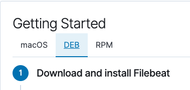

## 13.1-13.3 Lesson Plan: ELK Stack Project Week

### Overview

This week, students will set up a cloud monitoring system by configuring an ELK stack server. Students will be introduced to the project and then begin working on it.


### Week Objectives

Students will use the following skills and knowledge to complete the project:

- Deploying containers using Ansible and Docker.
- Deploying Filebeat using Ansible.
- Deploying the ELK stack on a server.
- Diagramming networks and creating a README.

### Instructor Notes

This is the last week of class before students begin to study security-specific material. Students have come a long way in the course, so be sure to acknowledge their hard work and the skills they've learned.

Instead of three separate lesson plans, this single lesson plan gives guidance for the entire week. It does not include specific times for individual portions of the week, but you should follow the day-by-day breakdown. If advanced students complete the work allotted for one day, they can move on to the next day's work.

While each student is expected to complete and submit projects individually, you can encourage students to work through problems together.

### Week Overview

#### Day 1

- Day 1 Instructor Dos:
   - Give an overview of the ELK stack and how it performs network security monitoring. This overview will also give students valuable context for why they’re configuring and deploying these tools during the week.

   - Provide the project overview as well as suggested milestones for each day. Note that these milestones are only suggested. If a student needs extra time on the project, let them know that they can continue their work during the second project week in the course.

	- Explain that due to Azure Free account limitations, students can only utilize 4vCPUs per region in Azure. Because of this, we will need to create a _new_ vNet in another region for our ELK server.

	- By the end of the project, we will have an ELK server deployed and receiving logs from all 3 Web VM's created in the cloud weeks.

	**Important:** Azure may run out of available VM's for the students to create a particular region. _IF_ this happens, Students will need to do one of 2 things:
	1. Students can open a support ticket with Azure support using [these instructions](https://docs.microsoft.com/en-us/azure/azure-portal/supportability/how-to-create-azure-support-request). Azure support is generally very quick to resolve issues.
	2. Students can create another vNet in another region and attempt to create the ELK sever in that region.

- Day 1 Activities: Configuring an ELK Server.

  Students will:
    1. Create a new vNet in Azure in a different region, within the same resource group.
		2. Create a peer-to-peer network connection between their vNets.
		2. Create a new VM in the new vNet that has 2vCPUs and a minimum of 4GiB of memory.
    2. Add the new VM to Ansible’s `hosts` file in their provisioner VM.
    3. Create an Ansible playbook that installs Docker and configures an ELK container.
    4. Run the playbook to launch the container.
    5. Restrict access to the ELK VM.

#### Day 2

- Day 2 Instructor Dos:
   - Give a brief overview of Filebeat before students begin activities.


- Day 2 Activities: Installing Filebeat

  Students will:
    1. Navigate to the ELK server’s GUI to view Filebeat installation instructions.
    2. Create a Filebeat configuration file.
    3. Create an Ansible playbook that copies this configuration file to the DVWA VMs and then installs Filebeat.
    4. Run the playbook to install Filebeat.
    5. Confirm that the ELK stack is receiving logs.
    6. Install Metricbeat as a bonus activity.

#### Day 3

- Students work on their projects, continuing the Filebeat activities, draft a network diagram of their completed setup, and complete a README.

- Please distribute these additional but optional Kibana challenges
  - [Optional Kibana Activities](/Activities/Kibana-Optional)
    - [Linux Stress Optional Activity](Activities/Kibana-Optional/Linux-Stress/Unsolved)
    - [SSH Barrage Optional Activity](Activities/Kibana-Optional/SSH-Barage/Unsolved)
    - [Web Request Dos Optional Activity](Activities/Kibana-Optional/wget-DoS/Unsolved)

### Lab Environment

Students continue using their personal Azure accounts and build upon their existing Azure VMs. They will **not** be using their cyberxsecurity accounts.

### Additional Resources
- [Ansible Documentation](https://docs.ansible.com/ansible/latest/modules/modules_by_category.html)
- [`elk-docker` Documentation](https://elk-docker.readthedocs.io/#Elasticsearch-logstash-kibana-elk-docker-image-documentation)
- [Virtual Memory Documentation](https://www.elastic.co/guide/en/elasticsearch/reference/current/vm-max-map-count.html)
- ELK Server URL: http://your-IP:5601/app/kibana#/home?_g=()
- [Docker Commands Cheatsheet](https://phoenixnap.com/kb/list-of-docker-commands-cheat-sheet)

### Slideshow

The slideshow to this week is located on Google Drive here: [ELK Stack Project Week (13) Slides](https://docs.google.com/presentation/d/1b0jbp5L_ws2iCFuOSnU7BfoXb6oSiWccqmwXKk8yJ0w/edit#slide=id.g4789b2c72f_0_6)

---

|:warning: **CHECKPOINT** :warning:|
|:-:|
| Please use the checklist located [HERE](../12-Cloud-Security/Resources/Checklist.md) to verify that students are ready for the project week. |

---

## Day 1: Configuring an ELK Server

### 01. Instructor Do: Project Overview  

Welcome students to class and explain that today is the first day of project week.

- The purpose of project week is to provide an opportunity to combine everything they've learned in order to create and deploy a live security solution.

- The course includes three projects in total. Two more will come later, in which students will expand on what they create this week, building an increasingly sophisticated skill-set and portfolio.

This week, students will deploy an ELK monitoring stack within their virtual networks. This will allow them to monitor the performance of their Web server that is running DVWA.

In particular, the ELK stack allows analysts to:
- Easily collect logs from multiple machines into a single database.

- Quickly execute complex searches, such as: _Find the 12 internal IP addresses that sent the most HTTP traffic to my gateway between 4 a.m. and 8 a.m. in April 2019._

- Build graphs, charts, and other visualizations from network data.

At the end of the week, students will have a fully functional monitoring solution, live on the cloud.

Emphasize that this will be a major achievement for a few reasons:
- Deploying, configuring, and using an ELK stack is a common task for network engineers, SOC analysts, and other security professionals. Completing this project will be proof of students' skills, which they can present to hiring managers.

- The ELK stack is very commonly used in production. Students will likely work for organizations that use either ELK or Splunk, covered later in the course. Experience with both is a great addition to a job application.

- Students can expand this network with additional machines on their own time to generate a lot of interesting log information. This sort of independent research is useful for learning, and hiring managers love to see it.

Finally, emphasize that the amount that students have learned in order to complete this project, including systems administration, configuration as code, virtualization, and cloud deployment, is substantial. Congratulate them on having made it this far.

Let students know that as they work through the project, they will develop the following "deliverables" that they can take with them and discuss at job interviews:

- **Network diagram**: This document is an architecture diagram describing the topology of their network.

- **Technical brief**: Answers to a series of questions explaining the important features of the suite, completed after deploying the stack.

- **GitHub repository**: Instructions are provided in this week's homework as to how to set up a Github account. After completing the project, students will save their work to a database, called a Git repository, along with an in-depth description of the project. This will make it easy for them to redeploy their work in the future, as well as share it with others.

Let students know that the rest of class will proceed as follows:
- Introduction to ELK: An overview of the technologies that make up the ELK stack and its capabilities.

- Project Work: The rest of the class will be spent working hands-on through the project steps to develop their networks.

Remind students that they can still complete this project even if they don't have all four VMs set up. They can add these VMs after they've completed the project tasks.

Explain that the next two days of class will be entirely dedicated to project work.

Take a moment to address questions before proceeding.

### 02. Instructor Do: Introduction to ELK

Explain that we'll cover what the ELK stack can do and how it works before students begin deploying it. Students should be familiar with ELK from previous units. Review the following:

ELK is an acronym. Each letter stands for the name of a different open-source technology:
- **Elasticsearch**: Search and analytics engine.
- **Logstash**: Server‑side data processing pipeline that sends data to Elasticsearch.
- **Kibana**: Tool for visualizing Elasticsearch data with charts and graphs.

ELK started with Elasticsearch. Elasticsearch is a powerful tool for security teams because it was initially designed to handle _any_ kind of information. This means that logs and arbitrary file formats, such as PCAPs, can be easily stored and saved.

- After Elasticsearch became popular for logging, Logstash was added to make it easier to save logs from different machines into the Elasticsearch database. It also processes logs before saving them, to ensure data from multiple sources has the same format before it is added to the database.

- Since Elasticsearch can store so much data, analysts often use visualizations to better understand the data at a glance. Kibana is designed to make it easy to visualize massive amounts of data in Elasticsearch, and it is well known for its complex dashboards.

Summarize by reiterating that:
- Elasticsearch is a special database for storing log data.
- Logstash is a tool that makes it easy to collect logs from any machine.
- Kibana allows analysts to easily visualize their data in complex ways.

Together, these three tools provide security specialists with everything they need to monitor traffic in any network.

#### The Beats Family

Reiterate that the ELK stack works by storing log data in Elasticsearch with the help of Logstash.

Traditionally, administrators would configure servers to collect logs using a built-in tool, like `auditd` or `syslog`. They would then configure Logstash to send these logs to Elasticsearch.

- While functional, this approach is not ideal because it requires administrators to collect all of the data reported by tools like `syslog`, even if they only need a small portion of it.

  - For example, administrators often need to monitor changes to specific files, such as `/etc/passwd`, or track specific information, such as a machine's uptime. In cases like this, it is wasteful to collect all of the machine's log data in order to only inspect a fraction of it.

Recently, ELK addressed this issue by adding an additional tool to its data collection suite called **Beats**.

- Beats are special-purpose data collection modules. Rather than collecting all of a machine's log data, Beats allow you to collect only the very specific pieces you are interested in.

Explain that ELK officially supports eight Beats and that students will use two of them in this project:
- **Filebeat** collects data about the file system.
- **Metricbeat** collects machine metrics, such as uptime.

  - Explain that a **metric** is simply a measurement about an aspect of a system that tells analysts how "healthy" it is. Common metrics include:
    - **CPU usage**: The heavier the load on a machine's CPU, the more likely it is to fail. Analysts often receive alerts when CPU usage gets too high.

    - **Uptime**: Uptime is a measure of how long a machine has been on. Servers are generally expected to be available for a certain percentage of the time, so analysts typically track uptime to ensure their deployments meet service-level agreements (SLAs).

Emphasize that Metricbeat makes it easy to collect specific information about the machines in the network. Filebeat enables analysts to monitor files for suspicious changes.

Let students know that they can find documentation about the other Beats at the official Elastic.co site: [Getting Started with Beats](https://www.elastic.co/guide/en/beats/libbeat/current/getting-started.html).

### 03. Instructor Do: Project Overview

Now that students understand ELK, it's time to begin deploying it. In this section, you will:
- Explain exactly what students will be building.
- Explain the milestones students should complete each day.

After that, students will spend the rest of the class configuring and deploying their ELK stack.

#### Project Setup

Explain that the goal of this project is to add an instance of the ELK stack to a new virtual network in another region in Azure and configure their 3 Web VM's to send logs to it.

Make sure that all students are logged into their personal Azure accounts and not cyberxsecurity. They will be using the VMs they created during the week on cloud security.

Since they will be building off of that week, take a moment to review the network architecture built in that unit.


Point out that this network contains:

- A gateway. This is the jump box configured during the cloud security week.

- Three additional virtual machines, one of which is used to configure the others, and two of which function as load-balanced web servers.
**NOTE:** Some students may have only created 2 webVM's during cloud week. This is OK.

- Explain that due to Azure Free account limitations, students can only utilize 4vCPUs per region in Azure. Because of this, we will need to create a new vNet in another region in Azure for our ELK server.

- By the end of the project, we will have an ELK server deployed and receiving logs from web machines in the first vNet.

**Important:** Azure may run out of available VM's for the students to create a particular region. _IF_ this happens, Students will need to do one of 2 things:
1. Students can open a support ticket with Azure support using [these instructions](https://docs.microsoft.com/en-us/azure/azure-portal/supportability/how-to-create-azure-support-request). Azure support is generally very quick to resolve issues.
2. Students can create another vNet in another region and attempt to create the ELK sever in that region.

Explain that, in order to set this up, students will perform the following steps:
1. Create a new vNet in a new region (but same resource group).
2. Create a peer-to-peer network connection between their two vNets.
3. Create a new VM within the new network that has a minimum of 4GiB of memory, 8GiB is preferred.
4. Download and configure an ELK stack Docker container on the new VM.
5. Install Metricbeat and Filebeat on the web-DVWA-VMs in their first vNet.

Emphasize that students will use Ansible to automate each configuration step.

At the end of the project, students will be able to use Kibana to view dashboards visualizing the activity of their first vNet.


Call attention to the fact that students will install an ELK container on the new VM, rather than setting up each individual application separately.

- **Important:** The VM for the ELK server **_MUST_** have at least 4GiB of memory for the ELK container to run properly. Azure has VM options that have `3.5 GiB` of memory, but _DO NOT USE THEM._ They will not properly run the ELK container because they do not have enough memory.
- If a VM that has 4GiB of memory is not available, the ELK VM will need to be deployed in a different region that has a VM with 4GiB available.

- Emphasize that, before containers, we would not have been able to do this. We would have had to separately configure an Elasticsearch database, a Logstash server, and a Kibana server, wire them together, and then integrate them into the existing network. This would require at least three VMs, and definitely many more in a production deployment.

- Instead, now students can leverage Docker to install and configure everything all at once.

Remind students that they took a similar approach when creating an Ansible control node within the network. They installed an Ansible container rather than installing Ansible directly. This project uses the same simplifying principle, but to even greater effect.

#### Project Milestones

Let students know that they will be working independently this week. They should aim to have certain amounts of work done each day. Specifically, the suggested milestones are:
- **Day 1** (Today): Configure the ELK server.

- **Day 2**: Complete installation of Filebeat and Metricbeat.

- **Day 3**: Finish any outstanding tasks from Day 2 and spend the majority of class finishing their network diagrams and answering questions in the brief.

For the remainder of the day, students will work on configuring an ELK server within their virtual network.

Emphasize that, while students must complete their projects individually, they can work through problems together, and should ask instructional staff for help if they get stuck.

#### Troubleshooting Theory

Go over some basic troubleshooting theory with the students.

Give an overview of the [Split-Half Search](https://www.peachpit.com/articles/article.aspx?p=420908&seqNum=3)

Explain that this is an extremely effective troubleshooting methodology that can be applied to _any_ technical issue to find a solution quickly.

Point out that the general procedure states that you should remove _Half_ of the variables that could be causing a problem and re-test. If the issue is resolved, you know that your problem resides in the variables that you removed. If the problem is still present you know your problem resides in the variables that you did not remove. Next, take the set of variables where you know the problem resides. Remove half of them again and retest. Repeat this process until you find the problem.

Explain that in the context of this project, removing half of your variables could mean:
- Logging into the Elk server and running the commands from your Ansible script manually.
	- This removes your Ansible script from the equation and you can determine if the problem is with your Ansible Script, OR the problem is on the ELK Server.
	- You can manually launch the ELK container with: `sudo docker start elk` OR (if the container doesn't exist yet); `sudo docker run -p 5601:5601 -p 9200:9200 -p 5044:5044 -it --name elk sebp/elk:761`

- Downloading and running a different container on the ELK server.
	- This removes the ELK container from the equation and you can determine if the issue may be with Docker or it may be with the ELK container.

- Removing half of the commands of your Ansible script (or just comment them out).
	- This removes half of the commands you are trying to run and you can see which part of the script is failing.

Point out that another effective strategy is to change _ONE_ thing and only _ONE_ thing before your retest. This is especially helpful when troubleshooting code. If you change several things before you re-test, you will not know if any one of those things has helped the situation or made it worse.

Provide any troubleshooting pointers from your professional experience that you think may be helpful.

#### References

- More information about ELK can be found at [Elastic: The Elastic Stack](https://www.elastic.co/elastic-stack).
- More information about Filebeat can be found at [Elastic: Filebeat](https://www.elastic.co/beats/filebeat).
- To set up the ELK stack, we will be using a Docker container. Documentation can be found at [elk-docker.io](https://elk-docker.readthedocs.io/).
- Peer networking in Azure How-To: [Global vNet Peering](https://azure.microsoft.com/en-ca/blog/global-vnet-peering-now-generally-available/)
- If Microsoft Support is needed: [How to open a support ticket](https://docs.microsoft.com/en-us/azure/azure-portal/supportability/how-to-create-azure-support-request)
- [Split-Half Search](https://www.peachpit.com/articles/article.aspx?p=420908&seqNum=3)

### 04. Student Do: ELK Installation

Send students the following activity and resource files, and review the high-level activity steps:

- [Day 1 Activity File: ELK Installation](Activities/Stu_Day_1/Unsolved/ReadMe.md) (also included below)
- [Day 1 Resources](Activities/Stu_Day_1/Unsolved/Resources/)

Use the solution guide for your review:

- [Day 1 Solution Guide: ELK Installation](Activities/Stu_Day_1/Solved/ReadMe.md)

## Activity File: ELK Installation

Today, you will configure an ELK server within your virtual network. Specifically, you will:

1. **Create a new vNet*** in a new region, within your resource group.

2. **Create a Peer Network Connection** between your two vNets.

3. **Create a new VM.** Deploy a new VM into the new vNet with it's own Security Group. This VM will host the ELK server.

2. **Download and configure a container.** Download and configure the `elk-docker` container onto this new VM.

3. **Launch and expose the container.** Launch the `elk-docker` container to start the ELK server.

4. **Implement identity and access management.** Configure your new Security group so you can connect to ELK via HTTP, and view it through the browser.

---
### Resources

- [`elk-docker` Container Documentation](https://elk-docker.readthedocs.io/)
- [Elastic.co: The Elastic Stack](https://www.elastic.co/elastic-stack)
- [Ansible Documentation](https://docs.ansible.com/ansible/latest/modules/modules_by_category.html)
- [`elk-docker` Image Documentation](https://elk-docker.readthedocs.io/#elasticsearch-logstash-kibana-elk-docker-image-documentation)
- [Virtual Memory Documentation](https://www.elastic.co/guide/en/elasticsearch/reference/5.0/vm-max-map-count.html#vm-max-map-count)
- ELK Server URL: http://[your.IP]:5601
- [Docker Commands Cheatsheet](https://phoenixnap.com/kb/list-of-docker-commands-cheat-sheet)

Azure Documentation:
- Azure's page on peer networks [HERE](https://docs.microsoft.com/en-us/azure/virtual-network/virtual-network-peering-overview)
- Peer networking in Azure How-To: [Global vNet Peering](https://azure.microsoft.com/en-ca/blog/global-vnet-peering-now-generally-available/)
- If Microsoft Support is needed: [How to open a support ticket](https://docs.microsoft.com/en-us/azure/azure-portal/supportability/how-to-create-azure-support-request)

Template configuration files for the first activity:

  - [hosts.yml](Activities/Stu_Day_1/Unsolved/Resources/hosts.yml)
  - [install-elk.yml](Activities/Stu_Day_1/Unsolved/Resources/install-elk.yml)

 It is recommended that you use these templates, but you can build your own if you'd like an additional challenge.

To ensure that these configuration templates do not change when copying them to your Ansible Container, use `curl` to get them onto your container. Using standard copy and paste is known to corrupt/change characters inside the configuration file and can cause them not to work.

---

### Getting Started

Before you begin, it is recommended that you create a high-level diagram of your intended new setup. You can use a tool like [draw.io](draw.io), or a pen and paper.

- Write down each of the machine's functions (jump box, Ansible, ELK server).
- As you complete the steps below, document the IP address associated with each machine.

**Note:** You can build off of this diagram for the Day 3 network diagram activity.  

We also recommend that you organize your folders in your Ansible machine as you see below:

```
etc # should already exist.
----> ansible # should already exist.
---------> ansible.cfg # should already exist.
---------> hosts # should already exist.
---------> roles # this is a new directory that will contain your ansible playbooks.
--------------> files # this is a new directory that will contain the configuration files we pass to you.
```
---
### Instructions

#### 1. Creating a New vNet

Make sure that you are logged into your personal Azure account, where your cloud security unit VMs are located.

- Create a new vNet located in the same resource group you have been using.

	- Make sure this vNet is located in a _new_ region and not the same region as your other VM's.

	- Leave the rest of the settings at default.
		- Notice that the IP Addressing has automatically created a new network space of `10.1.0.0/16` which is exactly what you want.

- Create a Peer connection between your vNets. This will allow traffic to pass between your vNets and regions. This peer connection will make both a connection from your first vNet to your Second vNet _And_ a reverse connection from your second vNet back to your first vNet. This will allow traffic to pass in both directions.

	- Navigate to 'Virtual Network' in the Azure Portal.

	- Select your new vNet to view it's details.

	- Under 'Settings' on the left side, select 'Peerings'.

	- Click the `+ Add` button to create a new Peering.

	- Make sure your new Peering has the following settings:

		- A unique name of the connection from your new vNet to your old vNet.
			- Elk-to-Red would make sense

		- Choose your original RedTeam vNet in the dropdown labeled 'Virtual Network'. This is the network you are connecting to your new vNet and you should only have one option.

		- Name the resulting connection from your RedTeam Vnet to your Elk vNet.
			- Red-to-Elk would make sense

	- Leave all other settings at their defaults.

#### 2. Creating a New VM

- Create a new Ubuntu VM in your virtual network with the following configurations:

    - **RAM**: 4 GB+
		- **Important:** The VM for the ELK server **_MUST_** have at least 4GiB of memory for the ELK container to run properly. Azure has VM options that have `3.5 GiB` of memory, but _DO NOT USE THEM._ They will not properly run the ELK container because they do not have enough memory.
		- A few specific machines that will work are:
			- Standard D2s v3 (2 vcpus, 8GiB memory)
			- Standard B2s (2vcpus, 4GiB memory
		- If a VM that has 4GiB of memory is not available, the ELK VM will need to be deployed in a different region that has a VM with 4GiB available OR you will need to open a support ticket with Microsoft (they often resolve issues very fast). See instructions for opening a ticket [HERE](https://docs.microsoft.com/en-us/azure/azure-portal/supportability/how-to-create-azure-support-request)

    - **IP Address**: The VM must have a public IP address.

    - **Networking**: The VM must be added to the new region in which you created your new vNet. You want to make sure you select your new vNEt and allow a new _basic_ Security Group to be created for this VM.

    - **Access**: The VM must use the same SSH keys as your WebVM's. This should be the ssh keys that were created on the _Ansible container_ that's running on your jump box.

		- Open a terminal on your computer and SSH into the jump box.

		- From the jump box login shell, run the required Docker commands to start and attach to your Ansible container.

		- Use `cat` to retrieve your _public_ ssh key (~/.ssh/id_rsa.pub)

		- As a reminder, your SSH key should not have a password on it because the password may cause Ansible errors. You can remove a password from your SSH key with: `ssh-keygen -p -f ~/.ssh/id_rsa`.

- After creating the new VM in Azure, verify that it works as expected by connecting via SSH from the _Ansible container_  on your jump box VM.

	- From the Ansible container shell, SSH into the new VM using it's internal IP.

	- Note that the new VM should be on a new subnet e.g `10.1.0.0/24` instead of `10.0.0.0/24`
		- Your subnet may vary, but if you used the default network settings your networks and subnets should fall into the default pattern of `10.0.0.0`, `10.1.0.0`, `10.2.0.0` etc.

If the connection succeeds, you are ready to move on to the next step. If not, verify that you used the correct SSH key (from inside the Ansible container). If the problem persists, you will need to troubleshoot further.

#### Some troubleshooting theory:

- Change one thing and retest. If you change several things before you re-test, you will not know if any one of those things has helped the situation or made it worse.
- Split-Half Search: Remove _Half_ of your variables that could be going wrong and re-test. If the issue is resolved, you know that your problem resides in the variables that you removed. If the problem is still present you know your problem resides in the variables that you did not remove.
	- Now take the set of variables where you know the problem resides. Remove half of them again and retest. Repeat this process until you find the problem.

- In this context, using the split-half search could mean:
	- Verifying that the VM is running in Azure. This removes your Jump Box from the equation and you can determine if their is a problem with the VM itself.
	- Use nmap or ping from your Jump-Box to the new VM to determine if you can make a connection. This removes `SSH` and the Ansible container from the equation. If you can't make a connection from your jump-box at all, you know the issue is _not_ with SSH or the Ansible container.
	- Remove your `Deny All` Security Group rule to allow _all_ traffic. This removes the Security Group from the equation. If you still cannot make a connection, you know the issue is _not_ with the Security Group.
	- Verify that you are attached to the Ansible container by running `whoami` or examining the command prompt:
		- Jump-box command prompt: `sysadmin@Jump-Box-Provisioner`
		- Ansible container command prompt: `root@6160a9be360e`

Still having trouble? Ask a classmate, instructor or TA for help!

---
|:warning: **CHECKPOINT** :warning:|
|:-:|
|Make sure the following critical items have been completed:|

- [] A new vNet has been created in your resource group in a _new_ region.
- [] The new vNet is located in a region other than the region you have used for all your other resources.
- [] A Peer connection has been created between vNets, allowing traffic to pass between them.
- [] A New VM has been created with a minimum of 4GB of memory (8GB is preferred).
- [] The new VM is configured to use the same ssh key that your Web VM's use (from the Ansible container)
- [] Ansible is able to connect to the new VM

---

#### 3. Downloading and Configuring the Container

In this step, you will use Ansible to configure the newly created VM. You will:

- From your Ansible container, add the new VM to Ansible's `hosts` file.

- Create a playbook that installs Docker and configures the container.

- Run the playbook to launch the container.

You just created a new VM, which you'll use to run your ELK stack. In order to use Ansible to configure this machine, you must add it to the list of machines Ansible can discover and connect to.
	- Don't forget to specify python3 with `ansible_python_interpreter=/usr/bin/python3`

- This list is Ansible's **inventory**, and is stored in the `hosts` text file:

	```
	# /etc/ansible/hosts
	[webservers]
	10.0.0.4 ansible_python_interpreter=/usr/bin/python3
	10.0.0.5 ansible_python_interpreter=/usr/bin/python3
  10.0.0.6 ansible_python_interpreter=/usr/bin/python3

	[elk]
	10.1.0.4 ansible_python_interpreter=/usr/bin/python3
	```

- `[webservers]` and `[elk]` are **groups**. When you run playbooks with Ansible, you specify which group to run them on. This allows you to run certain playbooks on some machines, but not on others.

You should already be in your Ansible VM. Add an `[elk]` group to your Ansible VM's `hosts` file by following the steps below on the command line:
  - Edit the inventory file `nano /etc/ansible/hosts`.

  - Add a group called `[elk]` and specify the IP address of the VM you just created in Azure.

  **Note:** If you get stuck, consult the starter `hosts` file:
- [Starter Host File](Activities/Stu_Day_1/Unsolved/Resources/hosts.yml)

##### Specifying Targets in Playbooks

Once you've created the `[elk]` group, you'll create a playbook to configure it.

- Today, you'll write a play to configure the ELK server. This play should only run on the VM in the `[elk]` group. Recall that you can use the `hosts` option in Ansible to specify which machines to run a set of tasks against.

  ```yaml
  - hosts: elk
  - become: True
  - tasks:
    - name: Install Packages
    # Etc...
  ```

- Here, the `hosts` option specifies that these `tasks` should only be run on the machines in the `elk` group.

To create this playbook, continue using your terminal to complete the following steps:
- Verify you are in your Ansible container.

- Create a new playbook: `touch /etc/ansible/install-elk.yml`.

- Ensure that the header of the playbook looks like the YAML snippet above. Specifically, it must specify `elk` as the target hosts.

Write `tasks` that do the following:
- Set the `vm.max_map_count` to `262144`
  - This configures the target VM (the machine being configured) to use more memory. The ELK container will not run without this setting.
	- You will want to use Ansible's `sysctl` module and configure it so that this setting is automatically run if your VM has been restarted.
	- The most common reason that the `ELK` container does not run, is caused by this setting being incorrect.
	- [Ansible sysctl](https://docs.ansible.com/ansible/latest/modules/sysctl_module.html)

- Installs the following `apt` packages:
  - `docker.io`: The Docker engine, used for running containers.
  - `python3-pip`: Package used to install Python software.

- Installs the following `pip` packages:
  - `docker`: Python client for Docker. Required by Ansbile to control the state of Docker containers.

- Downloads the Docker container called `sebp/elk:761`.

- Configures the container to start with the following port mappings:
  - `5601:5601`
  - `9200:9200`
  - `5044:5044`

  **Hint:** Use the Ansible module `docker-container` along with published port mappings. [More info at Ansible.com](https://docs.ansible.com/ansible/latest/modules/docker_container_module.html#examples).

- Starts the container.

Refer to the documentation on Ansible's [docker_container](https://docs.ansible.com/ansible/latest/modules/docker_container_module.html) and [docker_image](https://docs.ansible.com/ansible/latest/modules/docker_image_module.html) modules for guidance.

#### 4. Launching and Exposing the Container
Check your playbook for typos and other errors, then run it.

After the playbook completes, you should still be in the Ansible container. From there, use the command line to SSH into the ELK server and ensure that the `sebp/elk:761` container is running by running: `docker ps`.

- You should see a single row whose second column is `sebp/elk`. `761` should show under `Tag`. Take a screenshot before proceeding to the next step.

**Note**: If you're stuck, refer to the starter `elk-playbook.yaml` file provided: [Starter `elk-playbook` File](Activities/Stu_Day_1/Unsolved/Resources/install-elk.yml).

##### Troubleshooting

If your container fails to start, you will need to troubleshoot the issue.

Two common issues are:
- The ELK container quits or doesn't launch
- The Ansible script fails

Use the split-half search.

- In this context, removing half of your variables could mean:
	- Logging into the Elk server and implementing the steps from your Ansible script manually using the equivalent Bash commands.
		- This removes your Ansible script from the equation and you can determine if the problem is with your Ansible Script, OR the problem is on the ELK Server.
		- You can manually launch the ELK container with: `sudo docker start elk` OR `sudo docker run -p 5601:5601 -p 9200:9200 -p 5044:5044 -it --name elk sebp/elk:761` if the container does not yet exist.

	- Split-Half could mean downloading and running a different container on the ELK server or trying different settings in your Ansible script.
		- This removes the ELK container from the equation and you can determine if the issue may be with Docker or it may be with the ELK container.
		- Docker has a simple container to verify that docker is running correctly. Just use the command: `docker run hello-world`
		- If you try different settings in your Ansible script, remember to change one thing at a time. If it doesn't help, you may not need it and can change it back.

	- Split-Half might mean removing half of the commands of your Ansible script (or just comment them out) OR, remove the specific command that is failing.
		- This removes half of the commands you are trying to run and you can see which part of the script is failing.
		- You can also remove all the other commands that are working, and only run the command that is failing to save time.

- The most common reason for the container failing to launch is a limit on map counts. Follow [these instructions from Elastic.co](https://www.elastic.co/guide/en/elasticsearch/reference/5.0/vm-max-map-count.html#vm-max-map-count) to verify you meet the requirement.

- Review the [official ELK stack documentation](https://elk-docker.readthedocs.io/#prerequisites).

- Ask for help!

---

|:warning: **CHECKPOINT** :warning:|
|:-:|
|Make sure the following critical items have been completed:|
- [] An Ansible Playbook has been created that installs and configures an ELK container.
- [] The Ansible Playbook can be run on the new VM
- [] The new VM is running the ELK container 

---

#### 5. Identity and Access Management

The final step is to restrict access to the ELK VM using Azure's network security groups (NSGs). You need to add your public IP address to a whitelist, just as you did when clearing access to your jump box.

- **Note:** Make sure you are on your Azure account for this step.

Recall that the ELK stack's web server runs on port `5601`. Open your virtual network's existing NSG and create an incoming rule for your security group that allows TCP traffic over port `5601` from your public IP address.

- **Note:** If you finish this step in the classroom, you will need to repeat this step at home to connect to Kibana from your personal network.

Verify that you can access your server by navigating to http://[your.ELK-VM.External.IP]:5601/app/kibana. Use the public IP address of your new VM.

- You should see this webpage:


If this is what you see, congratulations! Take a screenshot of your dashboard before proceeding.

### Troubleshooting
Use the split-half search!

In this context, Split-Half could mean logging into the ELK VM and running `curl localhost:5601/app/kibana` from the command line.
		- This removes your browser and the security group from your equation and you can see if this command returns any HTML. If it does, you know that the ELK VM is working! The problem is likely with your connection through the browser. No HTML means that there is a problem with the ELK container.

If it's not the container, think about the variables that could affect your connection to a website from your browser...
	- Your home Network Firewall
	- Your Azure Security group
	- The browser itself

Some things to try:
	- Try another browser. This removes the entire browser from the picture in case of any cache issues, plugin conflicts or other issues.
	- If it's not the browser, try allowing _all_ traffic in your Azure Security group. This removes the security group from the equation.
	- If it's not the security group, could it be your home's firewall or your IP address has changed? You can remove this variable by switching to your phone's hotspot, or trying from a friend's network.
		- If you switch networks, remember to update your security group rules to allow traffic from your new IP address.


### Example Troubleshooting Scenario:

- The Ansbile Script has completed without errors.
- SSH from the Ansible Jump box to the ELK VM works.
- `sudo docker ps` shows that the ELK container is running with the correct ports.
- `curl http://localhost:5601/app/kibana` _does_ return HTML.
- Navigating to `http://<ELK.VM.External.IP>:5601/app/kibana` from a browser does not load a webpage.

Split-Half:
- Ansible ran just fine and the ELK container is running a webpage so these variables can be removed.
- The variables that are left are:
	- The Local network and firewall
	- The Firefox Browser
	- The Azure Security Group

We have 3 variables left, so we can't split them in half but rather will try one at a time, starting with the Local Network.

- Other webpages are loading without an issue, so the local network is not likely the problem.

We have 2 variables left.

- After trying the Google Chrome browser it also does not load the page. This suggests that the issue is _not_ with the browser.

At this point we know the issue is most likely with the Security Group.

- Check if `ping` is working from the command line of the local computer to the ELK VM. This removes the browser again and removes the `HTTP` protocol from the equation.
	- `ping` is not working.

- Use `nmap -p 80 <elk.vm.external.ip>` to check if port 80 is allowing traffic.
	- nmap returns that port 80 is `filtered`.

Now we know that the Security Group is blocking not only `ICMP` but also `HTTP` protocols. The security group appears to be the problem.

- Check the Security Group settings and create a new rule that allows any port and any protocol from the internet to the Virtual Network.
	- Note that this setting is _highly_ insecure and should only be done for testing. This removes your public IP setting from the SG rule and checks if any computer can access the VM.

- Check if `ping` is working from the command line once more.
	- `ping` is now working.

- Attempt to Navigate to `http://<ELK.VM.External.IP>:5601/app/kibana` once more.
	- The website is now loading.

- We have identified that the problem is somewhere in the Security Group rules! How can we determine what rule is the problem? Split-Half again!
	- At this point you may know exactly what rule is the problem, or you might have a few rules that could be the issue.
	- Start with one rule at a time and modify them until you find the setting that is causing the problem.
	- You can even split-half all of the settings that make up each rule!
	- Continue with this process until you have a working setup.

Still having trouble?
Ask for help! Work with your classmates, instructor and TA's to find a solution.

---

### Day 1 Milestone

In today's class, you:
- Deployed a new VM on your virtual network.
- Created an Ansible play to install and configure an ELK instance.
- Restricted access to the new server.

Completing these steps required you to leverage your systems administration, virtualization, cloud, and automation skills. This is an impressive set of tools to have in your toolkit.

---

|:warning: **CHECKPOINT** :warning:|
|:-:|
| Please use the checklist located [HERE](Resources/Checklist.md) to verify that students are ready day 2. |

- [] A new vNet has been created in your resource group in a _new_ region.
- [] The new vNet is located in a region other than the region you have used for all your other resources.
- [] A Peer connection has been created between vNets, allowing traffic to pass between them.
- [] A New VM has been created with a minimum of 4GB of memory (8GB is preferred).
- [] The new VM is configured to use the same ssh key that your Web VM's use (from the Ansible container)
- [] Ansible is able to connect to the new VM
- [] An Ansible Playbook has been created that installs and configures an ELK container.
- [] The Ansible Playbook can be run on the new VM
- [] The new VM is running the ELK container
- [] The ELK website is only accessible from your public IP address

---

### 02. Student Do: Day 2: Filebeat Installation

Please send students the following Day 2 activity and resource files, and review the high-level activity steps:

- [Day 2 Activity File: Filebeat Installation](Activities/Stu_Day_2/Unsolved/ReadMe.md) (also included below)
- [Day 2 Resources](Activities/Stu_Day_2/Unsolved/Resources/)

 **Instructor Note:** The Resources folder includes an `ansible.cfg` file. Students will not need to do anything with this file. It's included in case a student accidentally edits or deletes their configuration file.

Use the solution guide for your review:
- [Day 2 Solution Guide: Filebeat Installation](Activities/Stu_Day_2/Solved/ReadMe.md)

### Activity File: Filebeat Installation

Now that we have our ELK monitoring server up installed and configured, we're going to add another tool called **Filebeat**.

Taking raw log files and trying to make sense of all the data is often difficult and time consuming. We can use Filebeat to collect, parse, and visualize ELK logs in a single command. This will help us better track our organizational goals.

By the end of class today, you should complete the following steps:
1. **Install Filebeat on the Web VM's**. Verify your ELK server container is up and running, and install Filebeat on your WebVM's.

2. **Create the Filebeat configuration file**. Create and edit the Filebeat configuration file for your DVWA VMs.

3. **Create the Filebeat installation play**. Create another Ansible playbook that accomplishes the tasks required to install Filebeat.

4. **Verify the installation and playbook**. Confirm that your installation and playbook worked by verifying that the ELK stack is receiving logs.
---

### Resources

Below are links to the Filebeat and Docker documentation. It is strongly suggested that you read through these before starting the activity:
- [Filebeat Container Documentation](https://www.elastic.co/beats/filebeat)
- [Docker Commands Cheat Sheet](https://phoenixnap.com/kb/list-of-docker-commands-cheat-sheet)

You can also use the following resources if you get stuck:
- [Docker and Ansible Cloud Week Cheat Sheet](../12-Cloud-Security/CheatSheet.md)
- [Ansible Roles](https://docs.ansible.com/ansible/latest/user_guide/playbooks_reuse_roles.html)
---

#### Getting Started

Today, you will continue building up your ELK server. Specifically, if you have completed the installation step, you will proceed to install **Filebeat**.

- Recall that Filebeat helps generate and organize log files to send to Logstash and Elasticsearch. Specifically, it logs information about the file system, including which files have changed and when.

- Filebeat is often used to collect log files from very specific files, such as logs generated by Apache, Microsoft Azure tools, the Nginx web server, or MySQL databases. Today you will be using it to monitor the Apache server and MySQL database logs generated by DVWA.

- Since Filebeat is built to collect data about specific files on remote machines, it must be installed on the VMs you want to monitor. You will install Filebeat on the DVWA container you created during the cloud security week. This will provide you with a rich source of logs after you complete your deployment.

---

### Instructions

#### 1. Installing Filebeat on the DVWA Container

First, make sure that the ELK server container is up and running:

- Navigate to http://[your.VM.IP]:5601/app/kibana. Use the public IP address of the ELK server that you created.

- Click 'Explore on my Own'

- If you do not see the Kibana server landing page, open a terminal on your computer and SSH into the ELK server.
  - Run `docker container list -a` to verify that the container is on.
  - If it isn't, run `sudo docker start elk`.

Next, use the ELK server's GUI to begin installing Filebeat on your DVWA VM.

Navigate to your ELK server's IP address:
- Click **Add Log Data**.
- Choose **System Logs**.
- Click on the **DEB** tab under **Getting Started**.

Here you will find the most up-to-date Filebeat installation instructions for Linux.



- Note that you do not need to do anything on this page. Since Filebeat is open source, it is updated frequently. Therefore, specific details around installation can change. This site will always have the most up-to-date instructions.


#### 2. Creating the Filebeat Configuration File

Next, we will create a Filebeat configuration file, after which we will create the Ansible playbook file.

At that point, we will translate the instructions in the DEB tab into a new Ansible play, which you will use to automatically install Filebeat on your DVWA machines.

- Translating installation instructions to reusable playbooks is a common task for modern infrastructure teams. Being able to explain the value of this task and the plays you've created will be valuable in job interviews.

- Creating this play will allow you to easily install Filebeat on any machine you want to monitor later, whether for class, work, or a personal project.

Open a terminal and SSH into your jump box:
- Start the Ansible container.
- Use the correct Docker command to attach to your Ansible container.

As mentioned earlier, the Filebeat installation instructions require you to create a Filebeat configuration file.
- You will need to edit this file so that it has the correct settings to work with your ELK server.

You can use the provided template for the Filebeat configuration file:

 [Filebeat Configuration File Template](Activities/Stu_Day_2/Unsolved/Resources/filebeat-config.yml).
 - Note that when text is copy and pasted from the web into your terminal, formatting differences are likely to occur that will corrupt this configuration file.

 - Using `curl` is a better way to avoid errors and we have the file hosted for public download [HERE](https://gist.githubusercontent.com/slape/5cc350109583af6cbe577bbcc0710c93/raw/eca603b72586fbe148c11f9c87bf96a63cb25760/Filebeat)

 - Run: `curl https://gist.githubusercontent.com/slape/5cc350109583af6cbe577bbcc0710c93/raw/eca603b72586fbe148c11f9c87bf96a63cb25760/Filebeat > /etc/ansible/files/filebeat-config.yml`

 ```bash
root@6160a9be360e:/etc/ansible# curl https://gist.githubusercontent.com/slape/5cc350109583af6cbe577bbcc0710c93/raw/eca603b72586fbe148c11f9c87bf96a63cb25760/Filebeat > filebeat-config.yml
  % Total    % Received % Xferd  Average Speed   Time    Time     Time  Current
                                 Dload  Upload   Total   Spent    Left  Speed
100 73112  100 73112    0     0   964k      0 --:--:-- --:--:-- --:--:--  964k
 ```

Once you have this file on your Ansible container, edit this file as specified in the Filebeat instructions (the specific steps are also detailed below).

- The username is `elastic` and the password is `changeme`.

- Scroll to line #1106 and replace the IP address with the IP address of your ELK machine.

  ```bash
  output.elasticsearch:
  hosts: ["10.1.0.4:9200"]
  username: "elastic"
  password: "changeme"
  ```

- Scroll to line #1806 and replace the IP address with the IP address of your ELK machine.

  ```   
  setup.kibana:
  host: "10.1.0.4:5601"
  ```

- Note that the default credentials are `elastic:changeme` and should not be changed at this step.


- Save this file in  `/etc/ansible/files/filebeat-config.yml`.

#### 3. Creating the Filebeat Installation Play

Next, create a new playbook that installs Filebeat and then copies the Filebeat configuration file you just made to the correct location.

- On the Ansible VM, create a playbook file, `filebeat-playbook.yml`.
  - Locate this file in your `/etc/ansible/roles/` directory.  

- Open your playbook and implement the following tasks:
  - Download the `.deb` file from [artifacts.elastic.co](https://artifacts.elastic.co/downloads/beats/filebeat/filebeat-7.4.0-amd64.deb).

  - Install the `.deb` file using the `dpkg` command shown below:
    - `dpkg -i filebeat-7.4.0-amd64.deb`
  - Copy the Filebeat configuration file from your Ansible container to your WebVM's where you just installed Filebeat. Make sure it is copied to: `/etc/filebeat/filebeat.yml`
    - Use Ansible's `copy` module to copy the entire configuration file to the correct place.
  - Run the following commands:
    - `filebeat modules enable system`
    - `filebeat setup`
    - `service filebeat start`

You may find the following hints and links helpful:
- This play should only run on the web machines that are running the DVWA containers.

- Refer to the [Ansible playbook documentation](https://docs.ansible.com/ansible/latest/user_guide/playbooks_intro.html#playbooks-intro) if needed.

- Use the Ansible `copy` module to move `filebeat-config.yml` onto the Web VMs.

- You can use the `command` module to run `curl`, `dpkg`, and Filebeat commands.

  - Use `curl -O` or `curl -o` to download the `dpkg` file.

**Note:** You can use the following template for configuring the Filebeat playbook: [Filebeat Playbook Template](Activities/Stu_Day_2/Unsolved/Resources/filebeat-playbook.yml). You can also build your own if you'd like an additional challenge.

After you create and save this file, run it to install Filebeat on the DVWA machines.

#### 4. Verifying Installation and Playbook
After the playbook completes, follow the steps below to confirm that the ELK stack is receiving logs from your DVWA machines:
- Navigate back to the Filebeat installation page on the ELK server GUI.
- On the same page, scroll to **Step 5: Module Status** and click **Check Data**.
- Scroll to the bottom of the page and click **Verify Incoming Data**.

If your installation was successful, take a screenshot of what you see before proceeding.

---

### Day 2 Milestone

If your ELK server is receiving logs, congratulations! You've successfully deployed a live, functional ELK stack and now have plays that can:
- Install and launch Docker containers on a host machine.
- Configure and deploy an ELK server.
- Install Filebeat on any Debian-flavored Linux server.

Even more significant is that you've done all of this through automation with Ansible. Now you can recreate exactly the same setup in minutes.

If you have time, create a play to install Metricbeat. After this, you'll have programmed plays to automatically install 25% of the most common Beats.

---
|:warning: **CHECKPOINT** :warning:|
|:-:|
| Please use the checklist located [HERE](Resources/Checklist.md) to verify that students are ready for the project week. |

- [] Created an Ansible Playbook that installs and configures filebeat
- [] The Ansible Playbook is able to be run on any of your Web VM's
- [] Filebeat is installed and running on each of your Web VM's
- [] The ELK server is receiving logs from each of your Web VM's

---

#### Bonus: Creating a Play to Install Metricbeat

Note that there are fewer instructions and setup files provided here. However, the process is similar to the one used for the Filebeat installation.

Navigate to your ELK server's IP.

- Click **Add Metric Data**.
- Click **Docker Metrics**.
- Click the **DEB** tab under **Getting Started** for the correct Linux instructions.


Return to your Ansible VM. Update your playbook with tasks that perform the following:
- Download the [Metricbeat `.deb` file](https://artifacts.elastic.co/downloads/beats/metricbeat/metricbeat-7.4.0-amd64.deb).

- Use `dpkg` to install the `.deb` file.
- Update and copy the provided [Metricbeat config file](https://gist.githubusercontent.com/slape/58541585cc1886d2e26cd8be557ce04c/raw/0ce2c7e744c54513616966affb5e9d96f5e12f73/metricbeat).
- Run the `metricbeat modules enable docker` command.
- Run the `metricbeat setup` command.
- Run the `metricbeat -e` command.

Verify that your play works as expected:
  - On the Metricbeat Installation Page in the ELK server GUI, scroll to **Step 5: Module Status** and click **Check Data**.

If your installation was successful, take a screenshot of what you see before proceeding.

---

## Day 3: Exploration and Diagramming

### 01. Instructor Do: Overview

Explain that today's class will proceed as follows:

- Students who need more time installing Filebeat on their DVWA machines can continue this work.

- Students who have finished the Filebeat installation will move on to create their network diagrams and project READMEs.

Please send students the following file and review the high-level activity steps:
- [Day 3 Activity File: Network Diagramming and README](Activities/Stu_Day_3/Unsolved/ReadMe.md) (also included below)

Use the solution guide for your review:

- [Day 3 Solution Guide: Network Diagramming and README](Activities/Stu_Day_3/Solved/ReadMe.md)

### Activity File: Network Diagramming and README

Today's class is dedicated to completing the installation of Filebeat and finalizing your network diagram.

If you've already finished installing Filebeat, congratulations! The final steps are to:
1. Finalize the network diagram you began during the cloud security week.
2. Draft a README explaining what you've built.

### Instructions

#### 1. Diagramming the Network

Now that you've deployed your ELK instance, your virtual network is "stable." You won't be adding anything to it for awhile.

Since the network is essentially complete, it's time to document what you've built. This is an important last step for any deployment.

Use [Gliffy](https://www.gliffy.com) or [Draw.io](https://draw.io) to diagram your network. Make sure your diagram includes:

- **VNet**: Create a box thate contains the machines on your virtual network. Within your VNet, diagram the following:
  - Jump box and other VMs
  - Ansible control node
  - Specify which VM hosts the DVWA Containers
  - Specify which VM hosts ELK Stack Containers

- **Security group**: Create a box around your VNet to indicate the security group, and use a text field to specify the rules you have in place.

- **Access from the internet**: Add an icon representing the public internet and indicate how it connects to VMs in your VNet.

Use a text field to label each VM with the following information:
- Network (IP) address
- Operating system and version
- Installed containers
- Exposed ports
- Allowed IP addresses

#### 2. Completing the README

As you know, all technical projects come with some sort of documentation. One of the most common forms of documentation is the README file, which is a simple markdown file containing information about a project.

README formats vary across projects, but you can use this template to get started: [README.zip](Resources/README.zip).

- Download and unzip the template. Inside, you'll find a file called `README.md`, which contains the template. Much of the contents are provided, but you must fill in the "TODO" fields.

- You will also notice an `Images` folder. A few TODO items require you to place screenshots in your `README.md`. Place your screenshots in the `Images` folder, and update the `README.md` template with the appropriate file name.  

For homework, you will create a GitHub repository where you will save your project files and this README. Your repository will include
- Your network diagram.
- A description of the deployment.
- Tables specifying access policies and network addresses.
- Usage instructions.

This professional-level repository will prove that you have the knowledge and communication skills that hiring managers are looking for.

While it may feel less substantial than the project itself, one of the most important skills a cybersecurity professional can have is the ability to articulate what they know. The README is an important capstone to the project and will serve as a compelling portfolio item for prospective employers.


#### Bonus

If you finish early or want to make further refinements to your deployment on your own time, consider the following next steps:
- Refer to the [official Ansible documentation](https://docs.ansible.com/ansible/latest/user_guide/playbooks_reuse_roles.html) on roles. Then, rewrite your existing playbooks as roles.
- Create roles for the remaining Beats.

---

### Turn off Your Machine

After completing your diagram, finishing the README, and presenting your work, make sure to **turn off** your virtual machines.

- Navigate to portal.azure.com.
- Search for and select "Virtual machines."
- Select every VM in the list.
- Click **Stop**. This will ensure you're never charged for any of the machines you used in the project.

---

### Wrap-Up

At the end of this unit, congratulate the students for their hard work on the projects, and all the work they've done for the past 13 weeks.

Emphasize that students should make sure their projects are complete, professionally presentable, and free of errors. Remind them that they can use these resources as proof of knowledge and experience in the hiring process.

---
© 2020 Trilogy Education Services, a 2U, Inc. brand. All Rights Reserved.  
