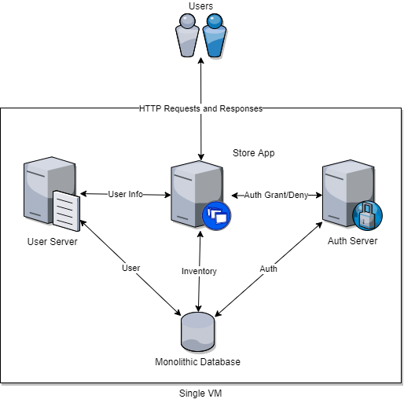
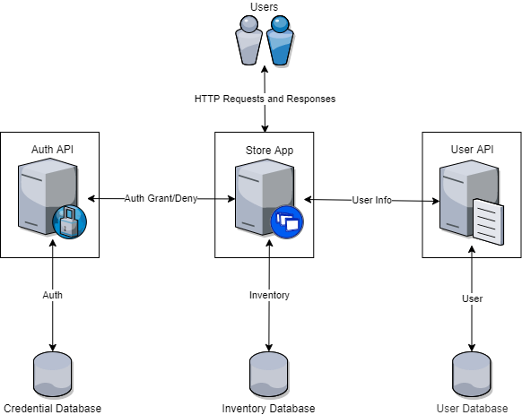

## Activity File: Monolith to Microservices

In this activity, you will play the role of a systems engineer.

- Your company has a web store app that is becoming popular. 

- The store must switch its architecture so it can be more redundant and scalable. You've decided to make the transition from traditional monolith to microservices.

- You have to design a microservices setup based on the current monolithic web store app diagram.

### Instructions

1. Review the current monolithic web store app diagram:

    

    - **Note:** It is not important that you know exactly what each microservice does. It _is_ important that you know _why_ you are separating them: You are separating them so that each will serve a single function, allowing for repeatable and scalable infrastructure.

2. Using your browser, go to the site [draw.io](https://www.draw.io/). Select **Open Existing Diagram** and select the file: `activity_one_unsolved.drawio`. 
    
    - Your instructor should have sent this file along with the activity instructions. 

4. Edit the diagram. As components are removed from the main rectangle, create a new rectangle to surround each individual component and label it accordingly. 

    - When you add a rectangle, right-click it and select **To Back** to make it look like it is behind the component. 

5. Using a rectangle, indicate each of the following servers:

    - Store app server
    - User server 
    - Authentication server 

6. In addition, split the monolithic database itself into three distinct components:

    - One database to handle all user information from the store app, such as preferences and sessions.
    - One database to store credential information that the authentication server checks against.
    - One inventory database that is updated when a user buys something from the store.

7. Connect each new database to its corresponding server.

#### Bonus

Your Customer Service department has been receiving complaints that the company's e-commerce store regularly times out when customers are trying to access it. This is a sign that the store app is unable to process all the requests.

- Redesign your setup to include a load balancer and two identical versions of the store app.

**Note:** Remember to show the basic information flows between the microservices.

## Solution Guide: Monolith to Microservices

In this activity you developed a microservices version of an existing web store app in order to prepare for redundancy and scaling.

---

1. Review the current monolithic web store app diagram:

    

    - **Note:** It is not important that you know exactly what each microservice does. It _is_ important that you know _why_ you are separating them: You are separating them so that each will serve a single function, allowing for repeatable and scalable infrastructure.

First, let's take a look at the original existing monolith for the web store app:

All of these servers exist in one VM.

2. Using your browser, go to the site [draw.io](https://www.draw.io/). Select **Open Existing Diagram** and select the file: `activity_one_unsolved.drawio`. 
    
    - Your instructor should have sent this file along with the activity instructions. 

4. Edit the diagram. As components are removed from the main rectangle, create a new rectangle to surround each individual component and label it accordingly. 

    - When you add a rectangle, right-click it and select **To Back** to make it look like it is behind the component. 

5. Using a rectangle, indicate each of the following servers:

    - Store app server
    - User server 
    - Authentication server 

Your microservices diagram should be similar to this:

The microservices include:

- A store app
- A user API
- An authentication API

6. In addition, split the monolithic database itself into three distinct components:

    - One database to handle all user information from the store app, such as preferences and sessions.
    - One database to store credential information that the authentication server checks against.
    - One inventory database that is updated when a user buys something from the store.

7. Connect each new database to its corresponding server.

You also split the monolithic database into three separate databases:

- A user database that handles all user information from the store app, such as preferences and sessions.

- A credential database that is used to store credential information that the authentication API will check user logins against.

- An inventory database that gets updated whenever a user buys something from the store.

The microservices connect to their corresponding databases in the following ways:

- The store app exchanges inventory info with the inventory database.

- The user API exchanges user info with the user database.

- The authentication API exchanges authentication info with the credential database.

Lastly, the APIs will interact with the store app in the following ways:

- The user API forwards user info to the store app.

- The authentication API forwards authentication grants or denials to the store app.

#### Bonus

Your Customer Service department has been receiving complaints that the company's e-commerce store regularly times out when customers are trying to access it. This is a sign that the store app is unable to process all the requests.

- Redesign your setup to include a load balancer and two identical versions of the store app.

**Note:** Remember to show the basic information flows between the microservices.

If you completed the bonus, you should have a diagram similar to the following:

In this diagram, we now have the additional microservices:

- Two replica store apps for redundancy and scale.

- A load balancer that has rules for balancing user sessions between the two replica store apps.

Explaining new connections:

- The connections between the APIs and store app replicas remain the same, but now there are twice as many connections.

- You may have load reporting connections between the store apps and load balancer. These let the load balancer know which store app has less load for handling requests and responses.

- Lastly, the load balancer should have connections going to each store app that show it forwarding requests and responses.

---
© 2020 Trilogy Education Services, a 2U, Inc. brand. All Rights Reserved.
