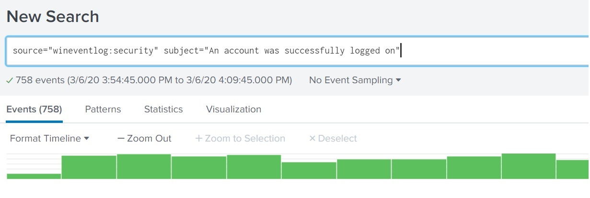
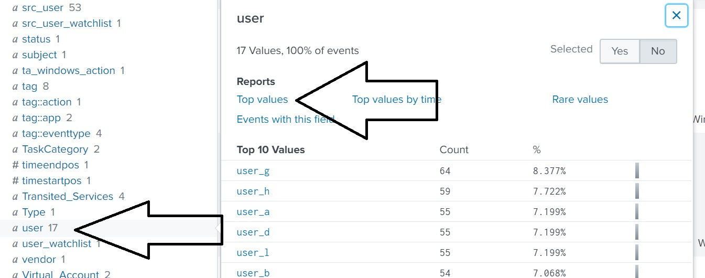
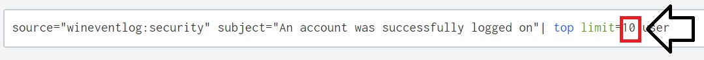
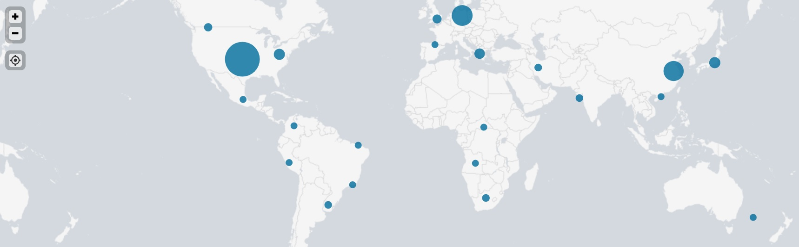
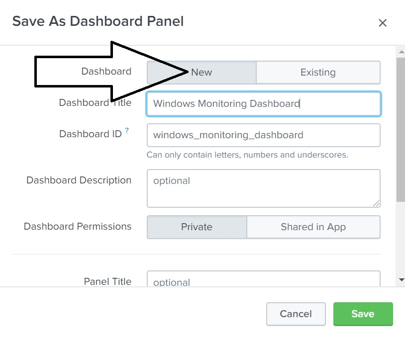
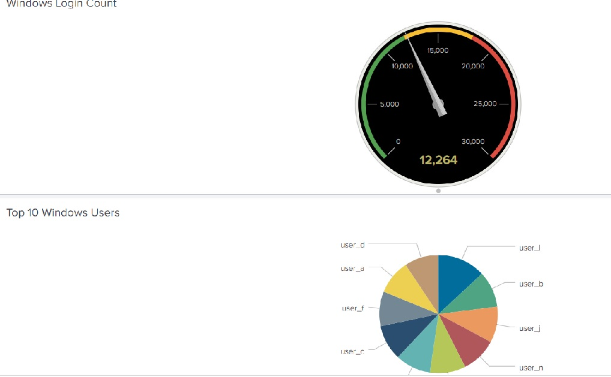
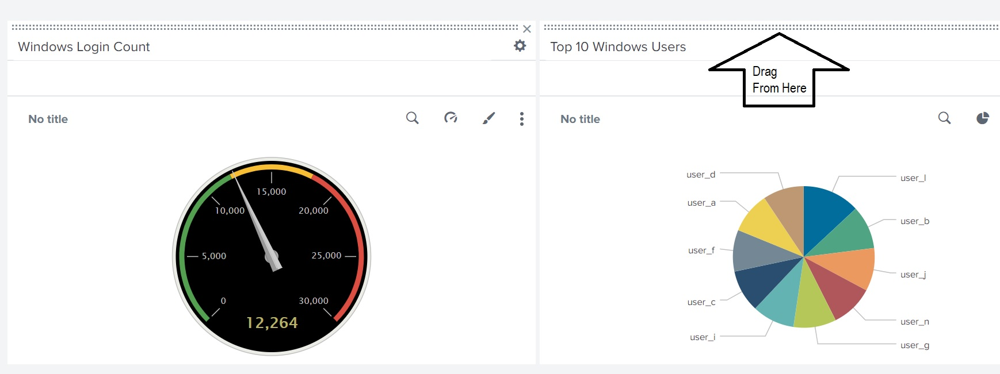
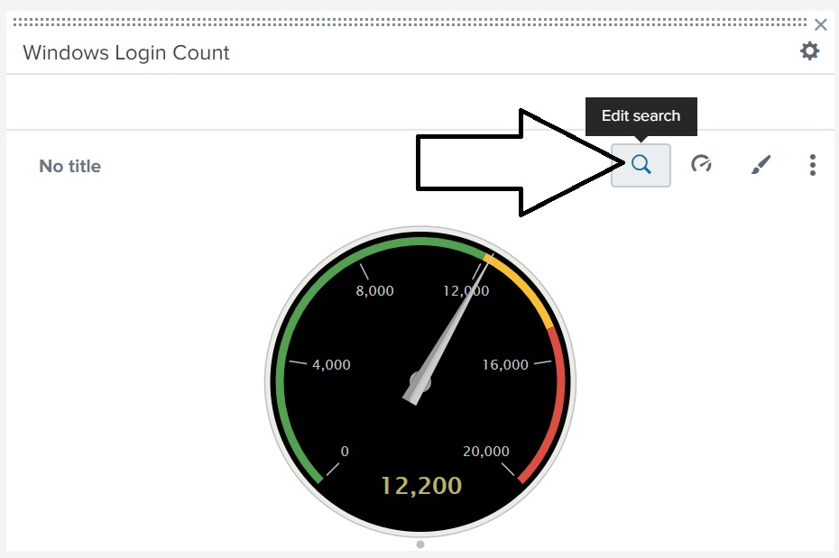
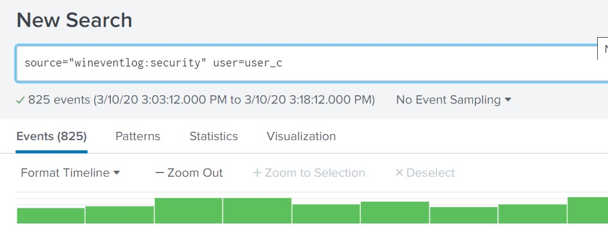

# 19.1 Lesson Plan: Splunk Dashboards and Visualizations

## Lab Setup

During this class, we will use the Splunk instance inside the Ubuntu VM.

- To launch, move into the `/splunk` directory and run the following script: 

  - `sudo ./splunk.sh`
  
  - On the first time running, select option 1.
  - All subsequent times, select option 2.

- Once the script completes, pull up your web browser in the Ubuntu VM and enter in the following URL: 

  - `localhost:8000/`

- At the Splunk Login Page, use the following credentials:
    - User: `admin`
    - Password: `cybersecurity`
  
- The logs for each lesson and activity are located in the `/splunk/logs` directory. 

## 02. Instructor Do: Introduction to Visualizations (0:10)

### Single Value Visualization Walkthrough

Explain that in this demonstration, we'll use a radial gauge visualization.

- **Radial gauges** are similar to the RPM dial found in the dashboard of a car. 

  - RPM (revolutions per minute) is a single value visualized in the dial.

  -  The dial includes a red section that indicates when the level is too high.
 
In this demonstration, we will use event data from a Fortinet Firewall Attack Log to create a radial gauge measuring the Oracle.9i.TNS.OneByte.DoS attack over a one hour period. 

1. Log into Splunk and open the Search & Reporting app.

2.  Load the following Splunk File: fortinet_IPS_logs.csv

3. Create the search value and enter the following search:

    - `source="fortinet_IPS_logs.csv"   attack_name="Oracle.9i.TNS.OneByte.DoS"`
    
    Specify a specific one-minute period by double-clicking the bar representing data from 4:24 PM (or another time of your choice)

    - Explain that while we are selecting a one-minute period as an example, a real SOC would make their own determination of which time period to monitor. This will depend on their own environment and the attacks they have seen in the past.

    
    
4. Turn this minute count into a single value by piping the SPL search into a `stats count as total` field:

   - Add `| stats count as total` to the end of the search and run the search again. 

   - Make sure the search spans the past 1 minute.

  

   **Note:** Your results may vary.

5. Next, we will turn this single value into a radial gauge. 

   - Select **Visualization** and then select the **Radial Gauge** option.

   

   - The different color values in this radial gauge were created by default by Splunk:
      - Green: 0-30
      - Yellow: 30-70
      - Red: 70-100

6. We can customize these ranges and colors based on our needs and preferences.
 
    - To edit, select **Format** > **Color Ranges** > **Manual**.

     

   - In this example, the value of that minute is 10 events, which we may consider the top of a normal level.

   - Change the ranges to:
      - Green: 0-10
      - Yellow: 10-20
      - Red: 20-30
  
      
  
7. Now the radial gauge displays the 10 events at the top of the green range.

    - Save this radial gauge by selecting **Save As** >  **Report** > **Choose a Title**.

    - Select the radial gauge icon under **Content**.
  
     
   
In the next activity, students will design a radial gauge to help OMP monitor attacks against their public-facing website.   

## 05. Instructor Do: Multiple Values Visualization  (0:10)

### Multiple Value Visualization Walkthrough

In this demonstration, we will use event data from Windows event logs to create a pie chart of top user logins. 

- Load the following Splunk File: demo_winlogs.csv
  
1. Run the following search:  

   - `source="demo_winlogs.csv" subject="An account was successfully logged on"`
   
   - **Note: Your values and counts may be differ from the screenshots.**
 
   
 
2. Create a report of the top values. 

    - Click the **user** field and select **Top values**. 

   
 
3.  Modify the top value to display the top 10 values.
    -  Click **Search** to update the results.
 
      
 
4. Under **Visualization**, select the pie chart icon under the **Bar Chart** heading.
 
    
   
   - The top 10 users with login data are displayed as a pie chart.  
 
    
  
5.  Demonstrate the interactivity by moving your mouse over any piece of the pie. 
  
     - It shows the specific count and percentage of each user.
  
     
   
6. Save the pie chart by selecting **Save As** > **Report** > **Choose a Title**.

    - Select the pie chart icon under **Content**.
  
## Geographic Maps Visualization Walkthrough

### **iplocation**

- Load the following file: demo_httplogs.csv

1. Run the following SPL command in the Search & Reporting app :
    - `source="demo_httplogs.csv"`
  
   - This log shows HTTP activity.

2. Identify the field containing IP address. This will be used to determine the location. 
  
   - We'll use the source IP address, indicated by the field `src_ip`.
      - Point out that we can also use the destination IP (`dest_ip`).
  
   - To determine the location data of the IP, run the following SPL command:
     - `source="demo_httplogs.csv" | iplocation src_ip`
  
   - The `iplocation` command will output the city and country data of the `src_ip` field.
  
   - **Note:** The `City` and `Country` fields should now appear on your fields list.  In case they aren't automatically added,  you may have to complete the steps below to select these fields from the **more fields** option.

      

3. Search for the **City** and **Country** fields. 

    - Check the box to add the fields.

       

    - The city and country should now appear on the **Selected Fields** list.

       

   - Click on the **Country** field to list the countries found based on the source IP address.

### **geostats**

Explain that next we will introduce the `geostats` command, which uses the location data found with the `iplocation` command to map latitude and longitude data for each event.
  
1. Use the `geostats` command by running the following search: 

    - `source="demo_httplogs.csv" | iplocation src_ip | geostats count`  
  
2. Next, go to the **Visualization** tab. 
   
   - Point out that Splunk has recommended a visualization called **Cluster Map** based on your search. 
   
  
        

   - Select the cluster map icon and explain that this tool places our search results on a geographic map.

       

3. Hover over the circles to demonstrate the interactivity. It will display the latitude, longitude, and count of each circle.

   - Point out that the size of each circle indicates the count of events in each city.

       

   - Use the **+** and **-** buttons on the left of the map to zoom in and out on the map.

       

Summarize this walkthrough by explaining that the geographic maps within Splunk are powerful visualizations that can help security teams quickly understand where activity is coming from.

## 12. Instructor Do:  Introduction to Dashboards (0:15)

### Creating Dashboards Demonstration

Explain that we will demonstrate how to create a dashboard using the following scenario:

 - As a SOC manager, you would like to create a single three-panel dashboard to monitor your Windows server. You want the panels to include:

   - A radial gauge of successful logins.
   - A pie chart of users logging in.
   - A statistical chart of the data in the pie chart.

Explain that we will still go through the process of creating each visualization. We'll start with the radial gauge.

- **Note: We will be using a log file for this demonstration which was already used:** `demo_winlogs.csv`
  - **There is no need to reload this file.**

1. Add the radial gauge with the following search: 
   - `source="demo_winlogs.csv" signature="An account was successfully logged on" | stats count as total`
   
    - Design and format the radial gauge visualization as needed.

3. To add this radial gauge to a dashboard, select **Save As** >  **Dashboard Panel**.

   

4. Since we haven't created the dashboard yet, select the **New** dashboard option.
   - Name the dashboard "Windows Monitoring Dashboard."
  
    
  
   - Name the panel "Windows Login Count."

   - Select **Radial Gauge** under **Panel Content**.
  
    
  
   - Select **Save**.

5. Confirm that the dashboard has been created by selecting **View Dashboard**.
      - This dashboard has only one panel. Let's add the next panel. 

    
  
  

    
  
6. Next, we will add the pie chart. 

    - Return to the Search & Reporting app and add the following search:
      - `source="demo_winlogs.csv"| top limit=10 user`
  
    Select the pie chart as the visualization. Then select **Save As** > **Dashboard Panel** again.
    
7. Since we already created the dashboard, we just need to add the new visualization to it.

   - Select **Existing** > **Windows Monitoring Dashboard**.

    

   - Title the Dashboard Panel "Top 10 Windows Users."

   - Select **Save** > **View Dashboard**.

   - Now the dashboard has multiple visualizations.

    

8. Dashboards can be edited by selecting **Edit**.
   - Rearrange panels by  dragging the panel to a new location on the dashboard.

   

   

   - Select **Save** to save your changes to the dashboard.

9. Explain that the last step is to add the third panel to the dashboard.
     - Add the search:
       - `source="demo_winlogs.csv"| top limit=10 user`
    - Follow the same steps for adding this to the dashboard.
    - The completed dashboard should look like the following: 
    
      

## 15. Instructor Do: Drilldowns and Dashboard Interactivity (0:10)

### Time Input Walkthrough
 
Explain that we will first walk through how to configure the dashboard to modify the date and time range.
 
1. Open the dashboard created in the last lesson:
    - Select **Dashboards** > **Windows Monitoring Dashboard**.
   
    
 
2. Select **Edit** to modify the dashboard.
   
   - Select **Add Input**, then select **Time**.

   - We can modify many features in the dashboard. Today, we will only cover the Time feature.
   
   
   
3. The top of the dashboard should now show a field where you can input time.
 
   - This feature will modify the time range of data displayed in each panel.

     
 
   
4. For the panels to work with this new feature, we have to reconfigure some settings for each panel.
   
   - To modify the first panel, select the magnifying glass icon to edit the search for the radial gauge.
 
     
 
   - Select **Shared Time Picker**.
     - This is the input that we just created.

   - Select **Apply**.
   
   
 
   - Repeat these steps for the other two panels.
 
   - Select **Save** to save the whole dashboard.
 
- There is now a working input on the dashboard where we can quickly change the time range of each panel.
 
  
   
### Drilldown Walkthrough
 
Next, we will add a **drilldown** to help us research specific data from a panel. 

Explain that a drilldown is similar to a dropdown menu, and has a variety of functions. 
 
1. Select the **Edit** option to modify the dashboard.
  
2. On the pie chart, select the three vertical dots for more actions, then select **Edit Drilldowns**.

    - Select **Link to search** in the dropdown.
    - Keep **Auto** selected.
    - Click **Apply**.

   

     

   - Save the dashboard. 
  
3. We now have the ability to search for a specific piece of the pie chart.

   - Demonstrate by selecting one of the pieces of the pie. 

    

    - This creates a search based on what was selected.

    

Explain that this drilldown feature allows a SOC analyst to quickly analyze data directly from the dashboard.

In the final activity, students will modify their dashboard to add the time-based input and drilldowns to assist OMP with research on security issues.

Answer any questions that students may have before the last activity.

